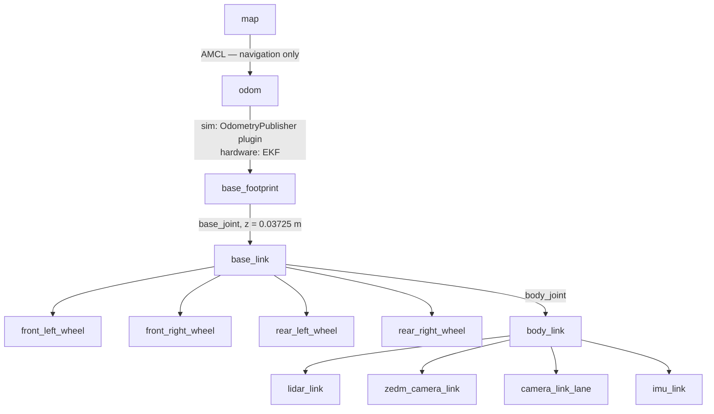
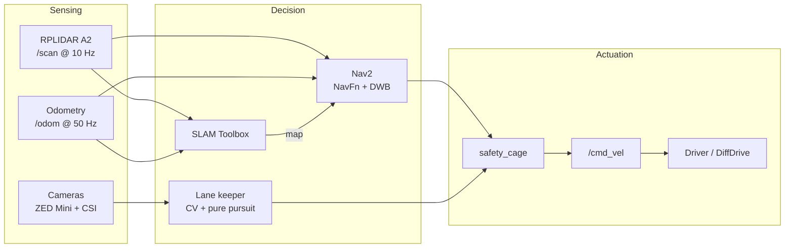

<h1 align="center">Waveshare Cobra Flex — 4WD Autonomous Mobile Robot</h1>

<p align="center">
  <i>A complete ROS 2 Humble stack for a 1:14 skid-steer robot — digital twin, SLAM,<br>
  Nav2 navigation, lane keeping and a runtime safety cage, from URDF to the physical car.</i>
</p>

<table>
<tr>
<td width="33%" align="center"><br><sub><b>CAD</b> — Autodesk Inventor</sub></td>
<td width="33%" align="center"><br><sub><b>Digital twin</b> — Gazebo Harmonic</sub></td>
<td width="33%" align="center"><br><sub><b>Physical robot</b> — Jetson Orin Nano</sub></td>
</tr>
</table>

<p align="center">
  
  
  
  
  
  
  
</p>

---

## Quick Start

```bash
# 1. Clone AS the workspace root -- this repo already contains src/
git clone https://github.com/snchz46/Waveshare-Cobra-Flex-ROS2-Autonomous-Car.git ~/ros2_ws
cd ~/ros2_ws && rosdep install --from-paths src --ignore-src -r -y

# 2. Build
colcon build --symlink-install && source install/setup.bash

# 3. Drive it (each in its own terminal)
ros2 launch cobraflex gazebo.launch.py              # simulation
ros2 launch cobraflex mapping.launch.py             # SLAM + RViz
ros2 launch cobraflex navigation.launch.py          # Nav2 (needs a saved map)
ros2 launch cobraflex lane_keeper_gazebo.launch.py  # lane following
```

Full setup in **[docs/INSTALLATION.md](docs/INSTALLATION.md)** · everyday commands in **[docs/USAGE.md](docs/USAGE.md)**.

---

## Table of Contents

- [What this is](#what-this-is)
- [Features](#features)
- [Robot specification](#robot-specification)
- [Gallery](#gallery)
- [Video demonstrations](#video-demonstrations)
- [System architecture](#system-architecture)
- [Mathematical model](#mathematical-model)
- [Simulation environments](#simulation-environments)
- [Documentation](#documentation)
- [Repository structure](#repository-structure)
- [Related work](#related-work)
- [Acknowledgements](#acknowledgements)
- [Author](#author)

---

## What this is

Off-the-shelf chassis like the Waveshare Cobra Flex give you a solid mechanical
platform and nothing else — no control, no localisation, no navigation. This
repository is the missing stack, built for **this** chassis rather than left on
library defaults:

| | |
| --- | --- |
| **Digital twin** | URDF/Xacro description, sensors and physics in Gazebo Harmonic, with inertias derived from a CAD assembly at measured component densities |
| **Navigation** | Nav2 + AMCL + SLAM Toolbox, parameterised to this robot's real 0.228 × 0.180 m footprint |
| **Hardware driver** | Python serial bridge to the ESP32-S3, with a deadman timeout and a 20 Hz keep-alive |
| **Lane keeping** | Two controllers — a histogram tracker on the Jetson CSI camera, and a calibrated CV estimator with pure-pursuit steering |
| **Safety cage** | A runtime monitor (`safety_cage`) that supervises whichever controller is driving |
| **Documentation** | Kinematics, control architecture and a fully sourced parameter reference |

Every number in the documentation is traced to the file it comes from. Where a
value is measured, assumed or still unresolved, it says so.

---

## Features

| Feature | Description |
| --- | --- |
| **Real-time SLAM** | SLAM Toolbox in asynchronous mode — graph-based 2D occupancy grids, loop closure in simulation |
| **Autonomous navigation** | Full Nav2 stack: NavFn global planner (Dijkstra) + DWB local controller |
| **Obstacle avoidance** | Reactive `/scan` → `/cmd_vel` node with its own scan deadman |
| **Lane keeping** | Classical CV on hardware; calibrated estimator + pure pursuit in simulation |
| **Runtime safety cage** | Filters the driving command before it reaches the actuators |
| **4WD skid-steer kinematics** | With EKF-fused odometry (`robot_localization`) on hardware |
| **Gazebo Harmonic** | Modern `gz-sim 8` with `ros_gz` bridging every sensor and actuator |
| **Teleoperation** | Standard `teleop_twist_keyboard` for manual driving during mapping |
| **Tuned parameters** | Nav2, AMCL, SLAM, DWB and EKF configs in [`src/cobraflex/config/`](src/cobraflex/config/), each carrying its rationale in comments |
| **Open source** | MIT licensed — free for academic, research and commercial use |

---

## Robot specification

| Parameter | Value | Source |
| --- | --- | --- |
| Total mass | 3.5 kg | bench measurement |
| Footprint (L × W) | 0.228 × 0.180 m | URDF |
| Wheel radius | 0.03725 m | URDF `wheel_radius` |
| Wheel separation (track) | 0.154 m | 2 × `wheel_off_y` |
| Wheelbase | 0.120 m | 2 × `wheel_off_x` |
| Circumscribed radius | 0.145 m | from the Nav2 footprint |
| Max linear velocity | 0.35 m/s planned · 0.53 m/s platform clamp | `nav2_params.yaml` · driver |
| Max angular velocity | 2.0 rad/s planned · 6.0 rad/s platform clamp | `nav2_params.yaml` · driver |
| Max linear acceleration | ±2.5 m/s² | `nav2_params.yaml`, DiffDrive plugin |
| Max angular acceleration | ±3.2 rad/s² | `nav2_params.yaml` |
| LiDAR | RPLIDAR A2 — 360°, 0.15–8 m, 10 Hz | datasheet |
| Camera | ZED Mini — 2K, up to 100 fps, 0.1–15 m depth | datasheet |
| Compute | Jetson Orin Nano Developer Kit | — |

The robot is bounded **twice**, at different values: Nav2 plans inside the first
column, and the serial driver clamps to the second before anything reaches the
firmware. Full breakdown in
[parameters.md §3.1](assets/Mathematical%20Model/parameters.md).

---

## Gallery

<div align="center">
<table>
  <tr>
    <td><br><sub>CAD design — Autodesk Inventor</sub></td>
    <td><br><sub>Mechanical assembly</sub></td>
  </tr>
  <tr>
    <td><br><sub>Digital twin in Gazebo Harmonic</sub></td>
    <td><br><sub>The same robot in RViz2</sub></td>
  </tr>
  <tr>
    <td><br><sub>Physical robot — front</sub></td>
    <td><br><sub>Physical robot — rear</sub></td>
  </tr>
  <tr>
    <td><br><sub>Sensor stack: LiDAR, ZED Mini, CSI camera</sub></td>
    <td><br><sub>CAD against the built robot</sub></td>
  </tr>
</table>
</div>

---

## Video demonstrations

<div align="center">

| Simulation | Mechanical assembly |
|:---:|:---:|
|  |  |
| <sub>Gazebo Harmonic digital twin</sub> | <sub>CAD design in Autodesk Inventor</sub> |

| SLAM and mapping | Autonomous navigation |
|:---:|:---:|
|  |  |
| <sub>Real-time mapping with the RPLIDAR A2</sub> | <sub>Nav2 driving to a goal in a mapped world</sub> |

| LiDAR → point cloud | LiDAR → projection |
|:---:|:---:|
|  |  |
| <sub>Scan lifted into a 3D point cloud</sub> | <sub>Projected onto the camera image</sub> |

</div>

---

## System architecture

### Transform tree



> **Exactly one node may publish `odom -> base_footprint`,** and which one
> differs per stack — the ground-truth `OdometryPublisher` in simulation, the
> EKF on hardware. Three publishers once fought over that edge and RViz jumped
> every cycle. The DiffDrive plugin's dead-reckoning TF is therefore diverted to
> `tf_diffdrive`, and `ekf_gazebo.yaml` sets `publish_tf: false`.

<div align="center">

<br><sub>The same tree as generated by <code>ros2 run tf2_tools view_frames</code></sub>
</div>

### Data flow



Every controller ends at the same interface: a `geometry_msgs/Twist` on
`/cmd_vel` carrying `linear.x` and `angular.z` only. What consumes it is the
Gazebo `DiffDrive` plugin in simulation, and `cobraflex_ros_driver` — which
clamps, applies a deadman and re-sends at 20 Hz — on hardware.

### SLAM and navigation

<div align="center">
<table>
<tr>
<td width="50%"><br><sub><b>SLAM Toolbox</b> — asynchronous graph SLAM, 10 Hz scans against 50 Hz odometry, with pose-graph optimisation and loop closure.</sub></td>
<td width="50%"><br><sub><b>Nav2</b> — NavFn global planner (Dijkstra), DWB local controller, dynamic costmaps with inflation and obstacle layers, plus spin/backup/wait recoveries.</sub></td>
</tr>
</table>
</div>

---

## Mathematical model

<div align="center">

</div>

The robot is a **skid-steer** treated throughout the stack as a differential
drive. Forward and inverse kinematics:

$$
v = \frac{r(\omega_R + \omega_L)}{2}
\qquad
\omega = \frac{r(\omega_R - \omega_L)}{W}
$$

That is the ideal model. With two axles 0.120 m apart the robot can only turn by
dragging all four wheels sideways, so the yaw channel carries a gain error the
equations above do not represent — quantified, with the open question about the
firmware's disagreeing track constant, in the full write-up.

**→ [Complete model: kinematics, control and parameters](assets/Mathematical%20Model/README.md)**

| Document | Covers |
| --- | --- |
| [Kinematics](assets/Mathematical%20Model/Kinematics.md) | Geometry, forward/inverse kinematics, odometry, limits, skid-steer correction |
| [Control](assets/Mathematical%20Model/Control.md) | The `/cmd_vel` chain in simulation and on hardware, plugin configuration |
| [Parameters](assets/Mathematical%20Model/parameters.md) | Mass budget, inertia tensors, sensors, SLAM profiles, firmware constants |

---

## Simulation environments

The lane-following track is a single textured plane — the *appearance* of the
road **is** the texture. The geometry is identical across a family, so any
difference in behaviour comes from perception rather than from the path.

| World | Purpose |
| --- | --- |
| `obstacles.world` | Default for `gazebo.launch.py` — SLAM and Nav2 demos |
| `oval_simple` | Gentler circuit, the easy lane-keeping baseline |
| `oval_complex` | Default lane-following circuit (`complex_b`) |
| `complex_b_flipH` / `flipV` | Same circuit mirrored — exposes a steering bias |
| `complex_b_worn_25/50/75` | Paint degraded 25/50/75 % — the intended degradation sweep |
| `complex_b_gaps` | Line dropouts — tests how the estimator holds through a gap |
| `straight_road.world` | Controller step responses |
| `empty.world` | Ground plane only, for URDF bring-up debugging |

Road textures are **generated**, not hand-painted, by the scripts under
`materials/road_assets/`. Full list:
[`src/cobraflex/worlds/README.md`](src/cobraflex/worlds/README.md).

---

## Documentation

| Document | Contents |
| --- | --- |
| **[Installation](docs/INSTALLATION.md)** | Clean-machine setup, hardware-only dependencies, troubleshooting |
| **[Usage](docs/USAGE.md)** | SLAM, navigation, lane keeping, physical bring-up, debugging |
| **[Mathematical Model](assets/Mathematical%20Model/README.md)** | Kinematics, control architecture, full parameter reference |
| **[Gazebo Simulation](assets/Gazebo%20Simulation/README.md)** | Simulation setup fundamentals |
| **[Worlds](src/cobraflex/worlds/README.md)** | Every SDF world and the texture generators |
| **[Maps](src/cobraflex/maps/README.md)** | Saving and loading occupancy grids |

---

## Repository structure

The repository **is** the ROS 2 workspace root: it carries `src/`, and
`colcon build` from the top level picks up all four packages.

```text
.
├── README.md
├── LICENSE                          # MIT, applies to the whole repository
├── docs/                            # Installation and usage guides
├── assets/                          # Documentation media and CAD, not built
│   ├── 3d-models/                   # STL / STEP for chassis and sensor mounts
│   ├── Mathematical Model/          # Kinematics, control and parameter reference
│   ├── Gazebo Simulation/           # Simulation setup notes
│   ├── photos/
│   └── videos/
└── src/
    ├── cobraflex/                   # Main package: driver, description, sim, nav
    │   ├── cobraflex/               # Nodes
    │   │   ├── cobraflex_ros_driver.py      # /cmd_vel -> JSON over serial
    │   │   ├── lidar_avoidance_node.py      # /scan -> /cmd_vel avoidance
    │   │   ├── lane_keeper_node.py          # CSI camera lane keeping (hardware)
    │   │   └── lane_keeper_gazebo_node.py   # CV + pure-pursuit lane keeping (sim)
    │   ├── config/                  # EKF, SLAM Toolbox, Nav2, gz bridge, ZED
    │   ├── launch/                  # Bringup, Gazebo, mapping, navigation
    │   ├── maps/                    # Saved occupancy grids (gitignored)
    │   ├── materials/road_assets/   # Generated road textures for the sim worlds
    │   ├── meshes/                  # Visual STLs referenced by the URDFs
    │   ├── rviz/                    # RViz layouts
    │   ├── urdf/                    # Robot descriptions + Gazebo plugin block
    │   └── worlds/                  # SDF worlds
    ├── cobraflex_rl/                # RL lane-following agent + shared CV estimator
    ├── safety_cage/                 # Runtime safety monitor over the controllers
    └── cobraflex_safety_msgs/       # CageStatus.msg (CMake / message generation)
```

`cobraflex` depends on `cobraflex_rl` in two places, deliberately:
`lane_keeper_gazebo_node` imports `cobraflex_rl.cv_lane_controller`, and
`cobraflex_sensors.launch.xml` runs its `csi_camera_node`. The sharing is the
point — the deployed controller and the scored evaluation run identical code.

---

## Related work

This repository is the **platform foundation**. The research built on top of it
lives in a separate repository:

| Repository | What it adds |
| --- | --- |
| **Cobra Flex** (here) | The robot: description, simulation, driver, SLAM, Nav2, lane keeping |
| **Safety Cages and Safe RL** *(master's thesis)* | An end-to-end camera PPO driver wrapped in a runtime safety cage, developed under an SE4AI methodology with full hazard-to-evidence traceability |

The two share the same four ROS 2 packages and the same physical robot. The
thesis repository extends them with the RL training pipeline, a scenario
library, hazard and requirement registers, and the experimental evidence.

---

## Acknowledgements

This project started from **[Axioma_robot](https://github.com/MrDavidAlv/Axioma_robot)**
by [MrDavidAlv](https://github.com/MrDavidAlv) — *"Robot autónomo ROS2 Humble |
SLAM + Nav2 + Gazebo | Navegación autónoma para logística industrial"*, released
under the BSD licence.

Axioma_robot is a ROS 2 Humble autonomous robot built on a 4WD skid-steer
chassis with SLAM Toolbox and Nav2 — the same class of platform and the same
software stack as this one — and it is where the idea for this project came
from. Its documentation, in particular the way the robot's mathematical model is
organised into kinematics, control and parameters, is the direct basis for
[`assets/Mathematical Model/`](assets/Mathematical%20Model/README.md).

The two robots are **different chassis**, and none of the numbers carry over:
Axioma runs a 0.0381 m wheel radius, a 0.1679 m effective track and a 0.26 m/s
top speed, against 0.03725 m, 0.154 m and 0.35 m/s here. Every figure in this
repository's documentation has been re-derived from its own URDFs, configuration
files, firmware source and bench measurements.

Thanks to MrDavidAlv for publishing the work openly.

---

## Author

| | |
| --- | --- |
| **Author** | Ing. Samuel Sanchez |
| **Institution** | Hochschule Esslingen |
| **Programme** | Automotive Systems M.Sc. |
| **Repository** | [snchz46/Waveshare-Cobra-Flex-ROS2-Autonomous-Car](https://github.com/snchz46/Waveshare-Cobra-Flex-ROS2-Autonomous-Car) |
| **License** | [MIT](LICENSE) — free for academic, research and commercial use |
