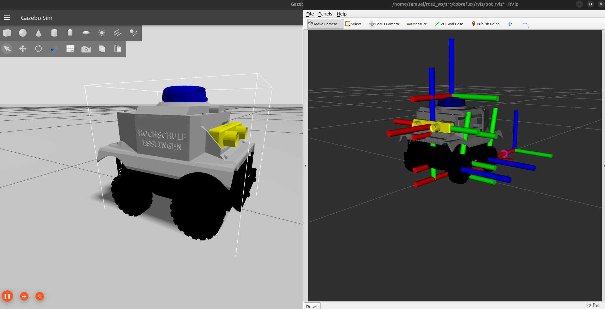
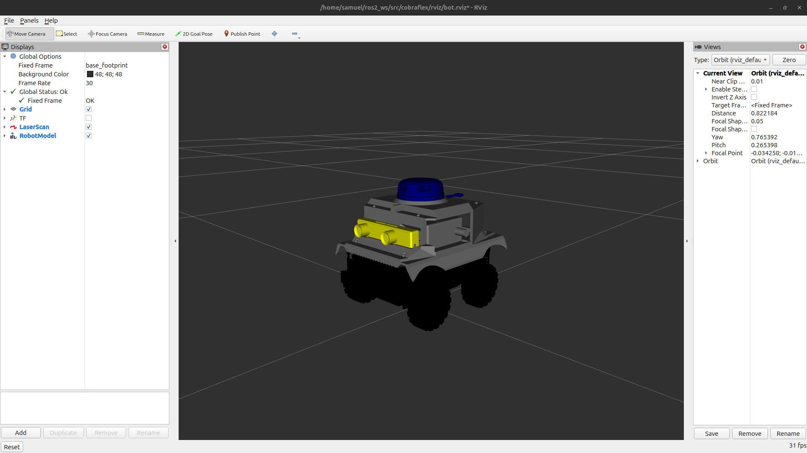
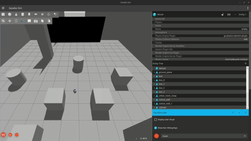
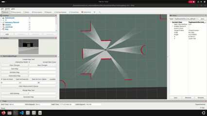
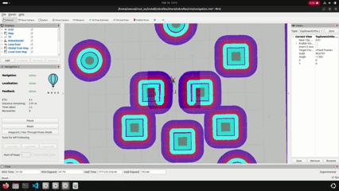
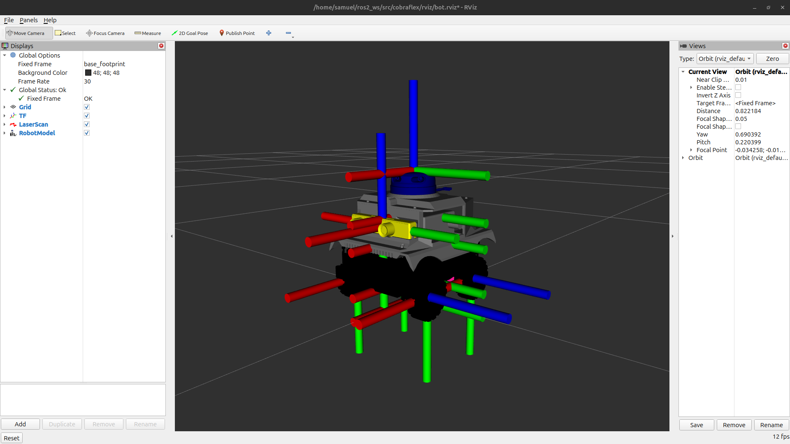
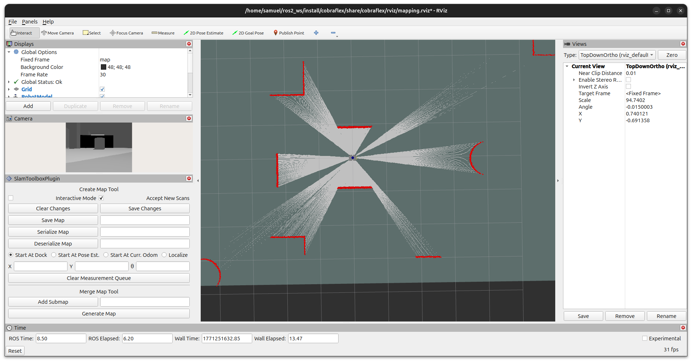
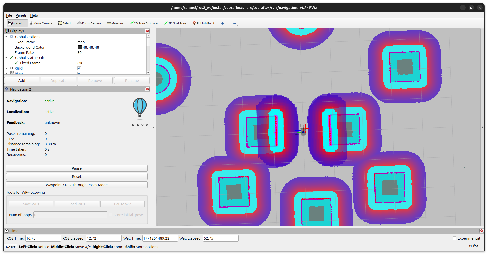

# Waveshare Cobraflex 4WD Autonomous Mobile Robot

| **CAD Design** | **SImulation** | **Physical Robot** 
|:---------------------:|:-----------------:|:-----------------:|
|  |  |  |


<div align="center" width="70%">

[](#)
[](#)
[](#)
[](#)
[](#)
[](#)
[](#)

</div>

---

## Table of Contents
  
- [Description](#description)
- [Robot Features](#robot-features)
- [Simulation Features](#simulation-features)
- [Robot Gallery](#robot-gallery)
- [Video Demonstrations](#video-demonstrations)
- [System Architecture](#system-architecture)
- [Mathematical Model](#mathematical-model)
- [Requirements](#requirements)
- [Quick Start](#quick-start)
- [Installation](#installation)
- [Build](#build)
- [Usage](#usage)
- [Project Structure](#project-structure)

---

## Description

This project implements autonomous navigation software using ROS2 for the **Cobraflex** mobile robot platform. The system integrates SLAM (Simultaneous Localization and Mapping) for real-time map construction, AMCL (Adaptive Monte Carlo Localization) for pose estimation, and Nav2 for trajectory planning and obstacle avoidance. The robot is designed for autonomous material transport in industrial production lines.

### Objectives

- Design a 3D simulation environment that replicates real workspaces with static and dynamic obstacles
- Equip the simulated robot with navigation sensors (LiDAR, encoders, IMU)
- Implement the ROS2 ecosystem for localization (AMCL), control (differential drive), and navigation (Nav2)
- Develop trajectory planning under kinematic constraints and obstacle avoidance
- Integrate the software stack with the physical Axioma.io robot

### Keywords

Mobile robot, autonomous navigation, industrial logistics, trajectory planning, ROS2 Humble, Gazebo Harmonic, Nav2, SLAM, differential drive, skid-steering

---

## Robot Features

| Parameter | Value |
|-----------|-------|
| Total mass | 5.95 kg |
| Dimensions (L x W x H) | 0.228 x 0.18 x 0.21 m |
| Wheel radius | 0.0375 m |
| Max torque | 20 N*m per wheel |
| LiDAR (RPLidar A2) | 360 samples, 360 deg, 0.12-8 m, 10 Hz |
| Camera (Zed mini) | 2K, 100FPS, 0.15-15 m, Depth Sensing |

---

## Simulation Features

<div align="center">

| Feature | Description |
|---------|-------------|
| **Real-time SLAM** | Simultaneous mapping and localization using SLAM Toolbox in asynchronous mode |
| **Autonomous Navigation** | Full Nav2 stack with global planner (NavFn/Dijkstra) and local controller (DWB) |
| **Obstacle Avoidance** | Real-time detection and evasion using 360-degree RPLidar A1 LiDAR |
| **Teleoperation GUI** | PyQt5 graphical interface with keyboard, virtual joystick, and slider control modes |
| **Keyboard Teleoperation** | Standard teleop_twist_keyboard support for manual control during mapping |
| **Full Visualization** | RViz2 with dynamic costmaps, planned trajectories, and AMCL particle clouds |
| **4WD Differential Robot** | Robust odometry from 1000 PPR encoders with skid-steering kinematics |
| **Gazebo Harmonic Simulation** | Modern Gazebo Sim with ros_gz bridge for all sensor and actuator interfaces |
| **Configurable Parameters** | All Nav2, AMCL, SLAM, and DWB parameters tunable per application |
| **Open Source** | BSD license, free for academic, research, and commercial use |

</div>

---

## Robot Gallery

<div align="center">
<table>
  <tr>
    <td></td>
    <td></td>
  </tr>
  <tr>
    <td></td>
    <td></td>
  </tr>
  <tr>
    <td></td>
    <td></td>
  </tr>
  <tr>
    <td></td>
    <td></td>
  </tr>
</table>
</div>

---

## Video Demonstrations

<div align="center">


*Complete walkthrough: real-time SLAM, map saving, and autonomous Nav2 navigation*

</div>

<div align="center">
  
| **SImulation** | **Mechanical Assembly** |
|:---------------------:|:-----------------:|
|  |  |
| *Gazebo Simulation* | *CAD design in Autodesk Inventor* |

| **SLAM and Mapping** | **Autonomous Navigation** |
|:------------------------:|:-----------------:|
|  |  |
| *Real-time mapping with LiDAR* | *Navigation in a mapped environment* |

</div>

---

## System Architecture

### Transform Tree (TF)

<div align="center">

</div>

Spatial transform tree: `map -> odom -> base_footprint -> base_link -> sensors`. The `odom_to_tf` node publishes the `odom -> base_link` transform from Gazebo odometry. AMCL publishes `map -> odom` to correct odometric drift during navigation.

### SLAM System

<div align="center">

</div>

SLAM Toolbox runs in asynchronous mode, building graph-based 2D occupancy grid maps in real time. It processes LiDAR scans at 10 Hz and odometry at 50 Hz with pose-graph optimization and loop closure detection.

### Navigation System

<div align="center">

</div>

The Nav2 stack integrates the NavFn global planner (Dijkstra), the DWB local controller (Dynamic Window Approach), dynamic costmaps with inflation and obstacle layers, and recovery behaviors (spin, backup, wait).

---

## Mathematical Model

<div align="center">

</div>

[Complete differential 4WD skid-steering kinematic model.](https://github.com/snchz46/Waveshare-Cobra-Flex-ROS2-Autonomous-Car/blob/main/assets/Mathematical%20Model/README.md) The diagram shows the robot geometry, control equations, Nav2 integration, and dynamic specifications.

### Key Parameters

| Parameter | Value |
|-----------|-------|
| Wheel radius | $r = 0.03725$ m |
| Wheel separation | $W = 0.154$ m |
| Total mass | $m = 5.95$ kg |
| Max linear velocity | $v_{max} = 0.56$ m/s |
| Max angular velocity | $\omega_{max} = 6.0$ rad/s |
| Max linear acceleration | $a_{max} = 2.5$ m/s² |
| Max angular acceleration | $\alpha_{max} = 3.2$ rad/s² |

**Differential kinematics:**

$$v = \frac{r(\omega_R + \omega_L)}{2}, \quad \omega = \frac{r(\omega_R - \omega_L)}{W}$$

---

## Requirements

### Software

- **Operating System**: Ubuntu 22.04 LTS
- **ROS2**: Humble Hawksbill
- **Gazebo**: Harmonic (gz-sim 8)
- **Python**: 3.8+
- **CMake**: 3.16+

### ROS2 Dependencies

```
ros-humble-ros-gz                  # Gazebo Harmonic integration
ros-humble-navigation2             # Full Nav2 stack
ros-humble-slam-toolbox            # SLAM mapping
ros-humble-rviz2                   # Visualization
ros-humble-teleop-twist-keyboard   # Keyboard teleoperation
ros-humble-robot-state-publisher   # URDF TF publishing
ros-humble-tf2-tools               # TF debugging utilities
```


---

## Quick Start

```bash
# 1. Install ROS2 Humble (Ubuntu 22.04)
sudo apt update && sudo apt install ros-humble-desktop

# 2. Install project dependencies
sudo apt install -y python3-colcon-common-extensions python3-rosdep python3-argcomplete \
                     ros-humble-ros-gz ros-humble-navigation2 ros-humble-nav2-bringup \
                     ros-humble-robot-state-publisher ros-humble-joint-state-publisher \
                     ros-humble-slam-toolbox ros-humble-teleop-twist-keyboard \
                     ros-humble-rviz2 ros-humble-xacro ros-humble-tf2-tools

# 3. Clone and build
mkdir -p ~/ros2__ws/src
cd ~/ros2_ws/src
git clone https://github.com/snchz46/Waveshare-Cobra-Flex-ROS2-Autonomous-Car.git .
cd ~/ros2_ws
colcon build --symlink-install
source install/setup.bash

# 4. Launch Robot (Gazebo)
ros2 launch cobraflex gazebo.launch.py

# 5. Launch SLAM (mapping)
ros2 launch cobraflex mapping.launch.py

# Or launch autonomous navigation (requires a saved map)
ros2 launch cobraflex navigation.launch.py
```

See [Installation](#installation) and [Usage](#usage) for detailed instructions.

---

## Installation

### 1. Install ROS2 Humble

```bash
# Configure locale and repository
sudo apt update && sudo apt install locales curl
sudo locale-gen en_US en_US.UTF-8
sudo curl -sSL https://raw.githubusercontent.com/ros/rosdistro/master/ros.key \
  -o /usr/share/keyrings/ros-archive-keyring.gpg
echo "deb [arch=$(dpkg --print-architecture) signed-by=/usr/share/keyrings/ros-archive-keyring.gpg] \
  http://packages.ros.org/ros2/ubuntu $(. /etc/os-release && echo $UBUNTU_CODENAME) main" \
  | sudo tee /etc/apt/sources.list.d/ros2.list > /dev/null

# Install ROS2 Humble Desktop
sudo apt update && sudo apt upgrade
sudo apt install ros-humble-desktop
```

### 2. Install Gazebo Harmonic

```bash
sudo apt install gz-harmonic ros-humble-ros-gz
```

### 3. Install Project Dependencies

```bash
sudo apt install -y \
  python3-colcon-common-extensions python3-rosdep \
  ros-humble-navigation2 ros-humble-nav2-bringup \
  ros-humble-slam-toolbox ros-humble-rviz2 \
  ros-humble-teleop-twist-keyboard ros-humble-joy \
  ros-humble-robot-state-publisher ros-humble-tf2-tools

sudo rosdep init && rosdep update
```

### 4. Clone the Repository

```bash
mkdir -p ~/ros2_ws/src
cd ~/ros2_ws/src
git clone https://github.com/snchz46/Waveshare-Cobra-Flex-ROS2-Autonomous-Car.git .
```

---

## Build

```bash
cd ~/ros2_ws
colcon build --symlink-install
source install/setup.bash
```

To automatically source the workspace on every new terminal:

```bash
echo "source ~/ros2_ws/install/setup.bash" >> ~/.bashrc
```

---

## Usage

### SLAM (Mapping)

Launch the simulation with Gazebo:

```bash
ros2 launch cobraflex gazebo.launch.py
```

Launch the simulation with SLAM Toolbox and RViz:

```bash
ros2 launch cobraflex mapping.launch.py
```

In a separate terminal, control the robot to explore the environment:

```bash
ros2 run teleop_twist_keyboard teleop_twist_keyboard
```

Or use the graphical teleoperation interface:

```bash
ros2 launch axioma_teleop_gui teleop_gui.launch.py
```

Save the map once the environment has been fully explored.


### Autonomous Navigation

Launch the simulation with Nav2 and RViz (requires a previously saved map):

```bash
ros2 launch cobraflex navigation.launch.py
```

In RViz2:

1. Use **2D Pose Estimate** to set the robot initial pose
2. Use **2D Goal Pose** to send a navigation goal
3. Monitor the global/local costmaps, planned paths, and AMCL particle distribution

### Useful Commands

```bash
# Monitoring
ros2 node list                           # Active nodes
ros2 topic list                          # Active topics
ros2 topic hz /scan                      # LiDAR frequency
ros2 topic echo /cmd_vel                 # Velocity commands
ros2 run tf2_ros tf2_echo map base_link  # TF lookup
ros2 run tf2_tools view_frames           # TF tree diagram

# Debugging
ros2 node info /slam_toolbox
ros2 param list /controller_server
ros2 bag record -a -o navigation_data
```

---

## Project Structure

```
ros2_ws/
└── src/
    ├── cobraflex/            
    │   └── cobraflex/
    │   │   ├── __pycache__/
    │   │   ├── __init__.py
    │   │   ├── cobraflex_odom.py
    │   │   ├── cobraflex_ros_driver.py
    │   │   └── lidar_avoidance_pid_node.py
    │   ├── config/
    │   │   ├── ekf_cobraflex.yaml
    │   │   ├── ekf_gazebo.yaml
    │   │   ├── gz_bridge.yaml
    │   │   ├── slam_params.yaml
    │   │   └── nav2_params.yaml (WIP)
    │   ├── launch/
    │   │   ├── gazebo.launch.py
    │   │   ├── mapping.launch.py
    │   │   ├── rsp.launch.py
    │   │   └── navigation.launch.py
    │   ├── meshes/
    │   │   ├── cobraflex_body.stl
    │   │   ├── cobraflex_chassis.stl
    │   │   ├── cobraflex_wheel.stl
    │   │   ├── rplidar-a2m4-r1.stl
    │   │   └── zedmini_camera.stl
    │   ├── rviz/
    │   │   ├── bot.rviz
    │   │   ├── mapping.rviz
    │   │   └── navigation.rviz
    │   ├── urdf/
    │   │   ├── inertial_macros.xacro
    │   │   ├── robot.gazebo
    │   │   └── robot.urdf
    │   └── worlds/
    │       ├── empty.world
    │       ├── obstacles.world
    │       └── test_world.sdf  
    │
    └── axioma_teleop_gui/         # PyQt5 teleoperation interface
        ├── axioma_teleop_gui/
        │   ├── main.py
        │   ├── main_window.py
        │   ├── ros_node.py
        │   └── widgets/
        │       ├── keyboard_mode.py
        │       ├── joystick_mode.py
        │       └── slider_mode.py
        └── launch/
            └── teleop_gui.launch.py
```

---


