<h1 align="center">Waveshare Cobra Flex — ROS 2 Autonomous Driving Lab</h1>

<p align="center">
  <i>ROS 2 Humble software stack for a 1:14 four-wheel skid-steer robot: digital twin,<br>
  SLAM, Nav2, lane keeping, reinforcement learning and a runtime safety cage.<br>
  Laboratory platform of the autonomous-driving module at Hochschule Esslingen.</i>
</p>

<table>
<tr>
<td width="30%" align="center">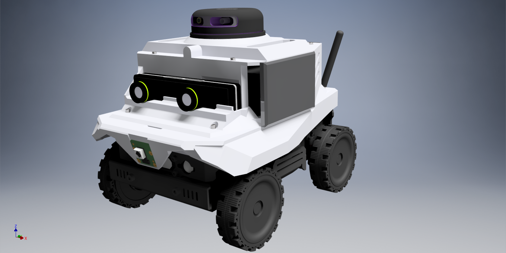<br><sub><b>CAD</b> · Autodesk Inventor</sub></td>
<td width="30%" align="center">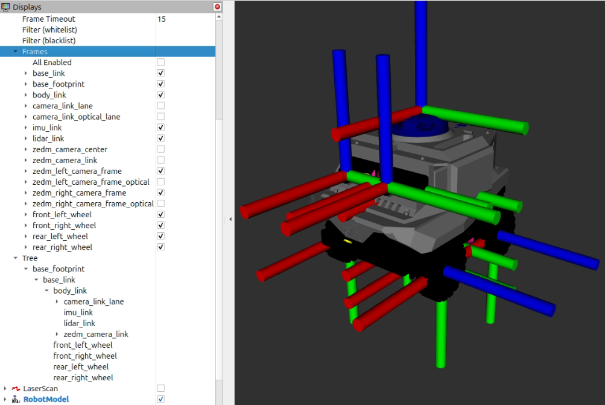<br><sub><b>Digital twin</b> · Gazebo Harmonic</sub></td>
<td width="25%" align="center">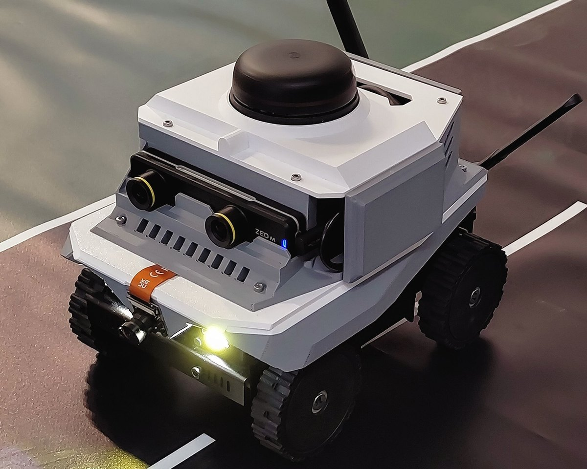<br><sub><b>Physical robot</b> · Jetson Orin Nano</sub></td>
</tr>
</table>

<p align="center">
  
  
  
  
  
  
  
  
</p>

<p align="center">
  <b><a href="#laboratory">Laboratory</a></b> ·
  <b><a href="#quick-start">Quick start</a></b> ·
  <b><a href="#capabilities">Capabilities</a></b> ·
  <b><a href="docs/concepts/README.md">Concepts</a></b> ·
  <b><a href="#documentation">Documentation</a></b>
</p>

---

## Demonstrations

<div align="center">

| Lane following, physical robot | Emergency stop, physical robot |
|:---:|:---:|
| 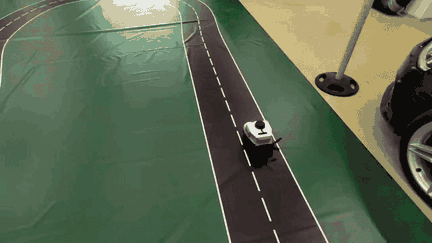 | 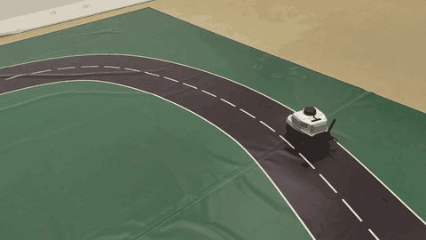 |
| <sub>One lap of the laboratory circuit, steered from the lane camera</sub> | <sub>Controlled stop within the lane</sub> |

| Camera policy under the safety cage | Autonomous navigation |
|:---:|:---:|
| 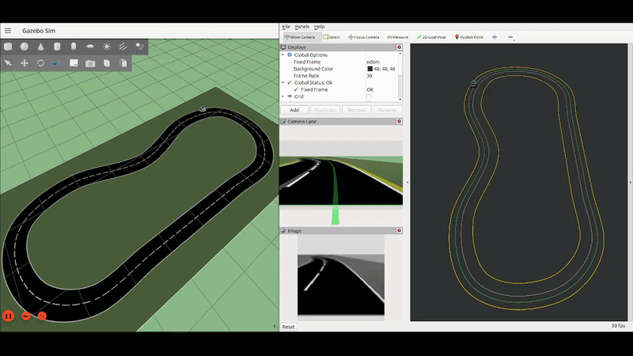 | 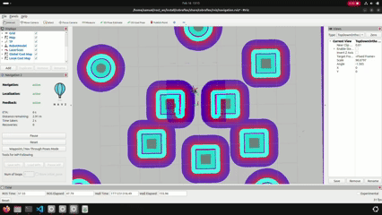 |
| <sub>Gazebo: PPO policy on <code>complex_b</code>; RViz shows the CV lane estimate and the policy input</sub> | <sub>Nav2 goal navigation in a mapped world</sub> |

| SLAM and mapping | Navigation with SLAM |
|:---:|:---:|
| 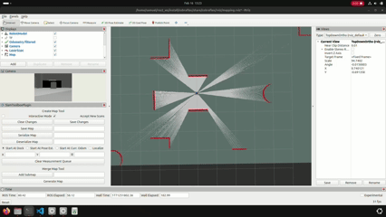 | 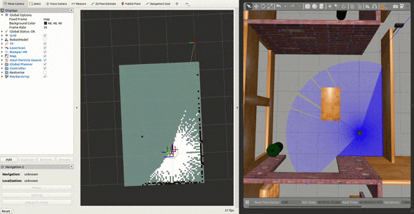 |
| <sub>Occupancy grid built online with SLAM Toolbox</sub> | <sub>Simultaneous navigation and mapping</sub> |

</div>

---

## Laboratory

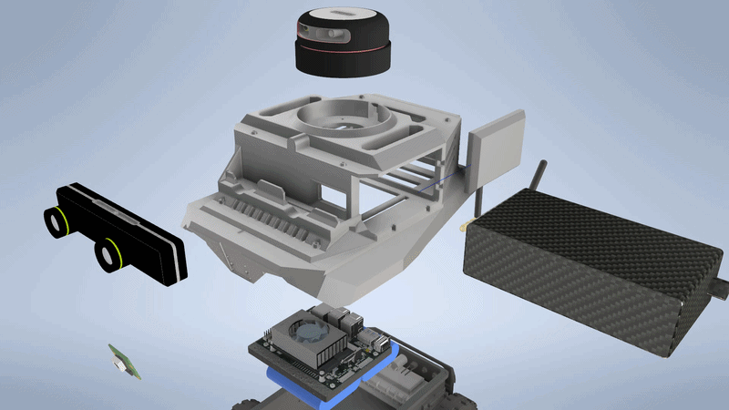

This repository is the basis of the practical sessions of the autonomous-driving
module of the **Automotive Systems M.Sc.** The exercises apply the content of
the lectures ADAS (SE4ADS), SLAM, Motion Planning and Computer Vision. Each
exercise runs first in Gazebo and then on the physical robot, with the same
nodes and topics in both environments.

<br clear="right"/>

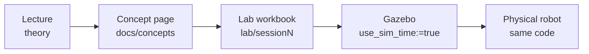
```mermaid
flowchart LR
    A["Lecture<br/>theory"] --> B["Concept page<br/>docs/concepts"]
    B --> C["Lab workbook<br/>lab/sessionN"]
    C --> D["Gazebo<br/>use_sim_time:=true"]
    D --> E["Physical robot<br/>same code"]
```

### Sessions

| # | Session | Lectures | Material |
| --- | --- | --- | --- |
| 1 | **ROS 2 basics and emergency braking** | ADAS (SE4ADS): ROS introduction | [`lab/session1/emergency_brake_node.py`](lab/session1/emergency_brake_node.py): gaps A to H, executed in Gazebo and on the robot |
| 2 | **Mapping and navigation** | SLAM · Motion Planning | SLAM Toolbox and Nav2, with a working copy of [`nav2_params.yaml`](src/cobraflex/config/nav2_params.yaml) |
| 3 | **Lane keeping and safety cage** | Computer Vision · ADAS (SE4ADS) | Lane-keeping and safety-cage launch files; `/cage_status` |

Execution of the lab scripts is described in **[lab/README.md](lab/README.md)**.
Solutions are not included in this repository.

### Concept pages

Each page presents the theory, the nodes, topics and parameters that implement
it, known pitfalls and test commands. Index: **[docs/concepts](docs/concepts/README.md)**.

| # | Page | Lectures |
| --- | --- | --- |
| 01 | [ROS 2 foundations](docs/concepts/01_ros2_foundations.md): nodes, topics, QoS, launch, TF, `/cmd_vel` interface | ADAS (SE4ADS): ROS introduction |
| 02 | [System architecture](docs/concepts/02_system_architecture.md): hardware, functional levels, serial protocol | ADAS (SE4ADS) ch. 3 |
| 03 | [State estimation](docs/concepts/03_state_estimation.md): odometry, Bayes filter, EKF, TF ownership | SLAM 03–05 |
| 04 | [SLAM and mapping](docs/concepts/04_slam_and_mapping.md): occupancy grids, scan matching, loop closure | SLAM 06, 10, 11 |
| 05 | [Localisation and navigation](docs/concepts/05_localization_and_navigation.md): AMCL, planners, costmaps | SLAM 09 · Motion Planning 1–3 |
| 06 | [Lane perception and control](docs/concepts/06_lane_perception_and_control.md): camera geometry, lane detection, pure pursuit | Computer Vision L02, L03 |
| 07 | [Reinforcement learning](docs/concepts/07_reinforcement_learning.md): MDP, PPO, CNN policy, domain randomisation | Motion Planning 3 · Computer Vision L06, L07 |
| 08 | [Safety cage](docs/concepts/08_safety_cage.md): runtime monitoring, rules C-01 to C-06 | ADAS (SE4ADS) ch. 2, 5 |
| 09 | [Multi-machine networking](docs/concepts/09_multi_machine_networking.md): DDS discovery, domain IDs, Wi-Fi | — |

### Operating rules for the physical robot

- **Simulation first.** Every exercise is validated in Gazebo before it runs on
  the robot. The topics are identical; only `use_sim_time` differs.
- **Single publisher on `/cmd_vel`.** Only one controller (own node, Nav2, lane
  keeper or teleoperation GUI) publishes at a time.
- **Deadman timers remain active.** The driver stops the robot 0.5 s after the
  last command (`cmd_timeout`). It is the only mechanism that stops the robot
  when its controller fails.
- **Dedicated `ROS_DOMAIN_ID`.** Each robot and its PC use their own domain
  (1–N, never 0); see [09](docs/concepts/09_multi_machine_networking.md).
- **Velocity envelope.** Nav2 plans within 0.35 m/s and 2.0 rad/s; the driver
  clamps all commands to 0.53 m/s and 6.0 rad/s before the firmware.

---

## Quick start

```bash
# 1. Clone as the workspace root (the repository contains src/)
git clone https://github.com/snchz46/Waveshare-Cobra-Flex-ROS2-Autonomous-Car.git ~/ros2_ws
cd ~/ros2_ws && rosdep install --from-paths src --ignore-src -r -y

# 2. Build
colcon build --symlink-install && source install/setup.bash

# 3a. Mapping and navigation: simulation first, then one tool per terminal
ros2 launch cobraflex gazebo.launch.py                  # obstacles.world
ros2 launch cobraflex_teleop_gui teleop_gui.launch.py   # manual driving
ros2 launch cobraflex mapping.launch.py                 # SLAM + RViz
ros2 launch cobraflex navigation.launch.py              # Nav2 (requires a saved map)

# 3b. Lane following: each launch file starts its own world; run one at a time
ros2 launch cobraflex lane_keeper_gazebo.launch.py      # CV estimator + pure pursuit
ros2 launch safety_cage lane_following.launch.py        # PD baseline under the safety cage
```

Physical robot:

```bash
ros2 launch cobraflex cobraflex_bringup.launch.xml   # description + serial driver
ros2 launch cobraflex cobraflex_sensors.launch.xml   # LiDAR + ZED Mini + CSI camera + EKF
```

Setup: **[docs/INSTALLATION.md](docs/INSTALLATION.md)** · Commands:
**[docs/USAGE.md](docs/USAGE.md)**.

---

## Capabilities

| Area | Description | Reference |
| --- | --- | --- |
| **Digital twin** | URDF/Xacro with inertias derived from the CAD assembly; Gazebo Harmonic with LiDAR, IMU, ZED Mini (stereo RGB, depth, point cloud) and CSI lane camera; USD asset for Isaac Sim | [`urdf/`](src/cobraflex/urdf/) · [`worlds/`](src/cobraflex/worlds/) |
| **State estimation** | EKF (`robot_localization`) with ZED visual odometry on the robot; one publisher of `odom → base_footprint` per stack | [03](docs/concepts/03_state_estimation.md) |
| **SLAM** | SLAM Toolbox, asynchronous mode, separate profiles for simulation and hardware | [04](docs/concepts/04_slam_and_mapping.md) |
| **Navigation** | Nav2: AMCL, NavFn global planner, DWB local controller, costmaps for the 0.228 × 0.180 m footprint | [05](docs/concepts/05_localization_and_navigation.md) |
| **Obstacle avoidance** | Reactive `/scan` → `/cmd_vel` node with scan timeout | `lidar_avoidance_node` |
| **Lane perception** | Calibrated CV lane estimator (lateral offset, heading error, curvature); histogram tracker on the CSI camera | [06](docs/concepts/06_lane_perception_and_control.md) |
| **Lane control** | Pure-pursuit steering on the CV estimate, shared by the deployed controller and the evaluation; PD baseline | [`cobraflex_rl`](src/cobraflex_rl/) |
| **Reinforcement learning** | PPO with a CNN on the lane camera (Stable-Baselines3), Gazebo training environment, domain randomisation, Isaac Sim backend, evaluation tools | [07](docs/concepts/07_reinforcement_learning.md) |
| **Safety cage** | Runtime monitor between controller and actuators: rules C-01 to C-06, perception supervisor, enforcement and monitoring modes, `/cage_status` | [08](docs/concepts/08_safety_cage.md) |
| **Hardware driver** | `/cmd_vel` → JSON over USB serial to the ESP32-S3; velocity clamps, 0.5 s deadman, 20 Hz keep-alive | [02](docs/concepts/02_system_architecture.md) |
| **Teleoperation** | Qt GUI (buttons, virtual joystick, sliders) and `teleop_twist_keyboard` | [`cobraflex_teleop_gui`](src/cobraflex_teleop_gui/README.md) |
| **Multi-machine operation** | Robot and PC on one ROS 2 graph over Wi-Fi; network rules for several robots | [09](docs/concepts/09_multi_machine_networking.md) |

Every value in the documentation references its source file and is marked as
measured, assumed or open where applicable.

---

## Robot specification


| Parameter | Value |
| --- | --- |
| Total mass | 3.5 kg (measured) |
| Footprint (L × W) | 0.228 × 0.180 m |
| Wheel radius | 0.03725 m |
| Track · wheelbase | 0.154 m · 0.120 m |
| Max linear velocity | 0.35 m/s planned · 0.53 m/s clamp |
| Max angular velocity | 2.0 rad/s planned · 6.0 rad/s clamp |
| Max acceleration | ±2.5 m/s² · ±3.2 rad/s² |

<br clear="right"/>

| Component | Part | ROS interface |
| --- | --- | --- |
| Compute | NVIDIA Jetson Orin Nano Developer Kit | All on-board nodes |
| Chassis controller | ESP32-S3 driver board, JSON over USB serial at 115200 baud | `cobraflex_ros_driver` |
| LiDAR | Slamtec RPLIDAR A2M8, 360°, 0.15–8 m, 10 Hz | `sllidar_ros2` |
| Stereo camera | Stereolabs ZED Mini, visual odometry and depth | `zed_wrapper` |
| Lane camera | IMX219-160 on CSI, 90° HFOV, 640 × 360 at 20 Hz | `csi_camera_node` |
| Power | 99 Wh powerbank (Jetson); 3S Li-ion pack (motors) | `/cobraflex/battery` |

Velocity is limited at two levels: Nav2 plans within the planned limits, and
the serial driver clamps to the platform limits before the firmware. Sources:
[parameters.md](assets/Mathematical%20Model/parameters.md).

---

## System architecture

### Data flow

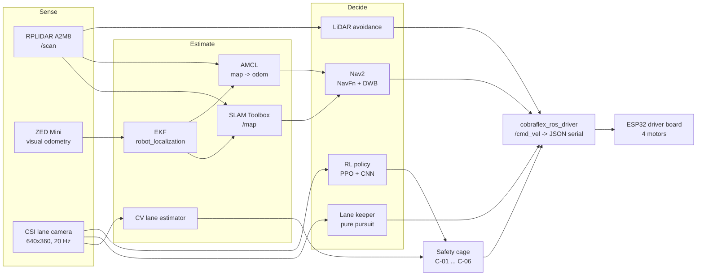
```mermaid
flowchart LR
    subgraph Sense
        L["RPLIDAR A2M8<br/>/scan"]
        Z["ZED Mini<br/>visual odometry"]
        C["CSI lane camera<br/>640x360, 20 Hz"]
    end
    subgraph Estimate
        E["EKF<br/>robot_localization"]
        S["SLAM Toolbox<br/>/map"]
        A["AMCL<br/>map -> odom"]
        V["CV lane estimator"]
    end
    subgraph Decide
        N["Nav2<br/>NavFn + DWB"]
        K["Lane keeper<br/>pure pursuit"]
        R["RL policy<br/>PPO + CNN"]
        O["LiDAR avoidance"]
    end
    G["Safety cage<br/>C-01 ... C-06"]
    D["cobraflex_ros_driver<br/>/cmd_vel -> JSON serial"]
    M["ESP32 driver board<br/>4 motors"]

    L --> S
    L --> A
    L --> O
    Z --> E
    E --> S
    E --> A
    S --> N
    A --> N
    C --> V
    C --> K
    C --> R
    V --> G
    R --> G
    N --> D
    K --> D
    O --> D
    G --> D
    D --> M
```

One controller is active at a time. All controllers publish a
`geometry_msgs/Twist` on `/cmd_vel` with `linear.x` and `angular.z`. In
simulation the Gazebo `DiffDrive` plugin consumes it; on the robot
`cobraflex_ros_driver` clamps it, applies the deadman timer and re-sends it at
20 Hz.

### Safety-cage chain

<div align="center">
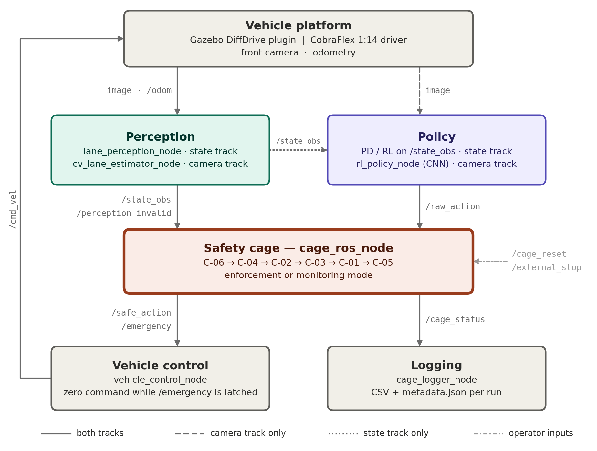
<br><sub>The policy output <code>/raw_action</code> passes through the safety cage, which applies its rules in a fixed order and forwards <code>/safe_action</code> to vehicle control. Reference: <a href="docs/concepts/08_safety_cage.md">08 · Safety cage</a>.</sub>
</div>

### Transform tree

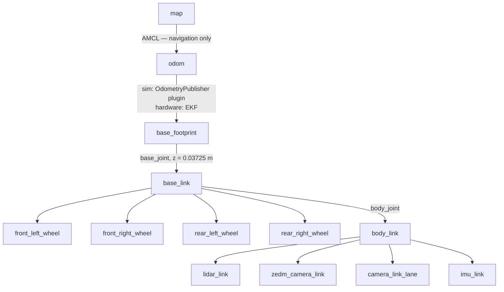
```mermaid
graph TD
    mapf["map"] -->|"AMCL — navigation only"| odomf["odom"]
    odomf -->|"sim: OdometryPublisher plugin<br/>hardware: EKF"| bf["base_footprint"]
    bf -->|"base_joint, z = 0.03725 m"| bl["base_link"]
    bl --> wfl["front_left_wheel"]
    bl --> wfr["front_right_wheel"]
    bl --> wrl["rear_left_wheel"]
    bl --> wrr["rear_right_wheel"]
    bl -->|"body_joint"| body["body_link"]
    body --> lidar["lidar_link"]
    body --> zed["zedm_camera_link"]
    body --> lane["camera_link_lane"]
    body --> imu["imu_link"]
```

> **Exactly one node publishes `odom -> base_footprint`:** the ground-truth
> `OdometryPublisher` in simulation and the EKF on hardware. A second publisher
> produces a jumping robot pose in RViz. For this reason the DiffDrive plugin
> publishes its dead-reckoning TF on `tf_diffdrive`, and `ekf_gazebo.yaml` sets
> `publish_tf: false`.

### SLAM and navigation

<div align="center">
<table>
<tr>
<td width="50%">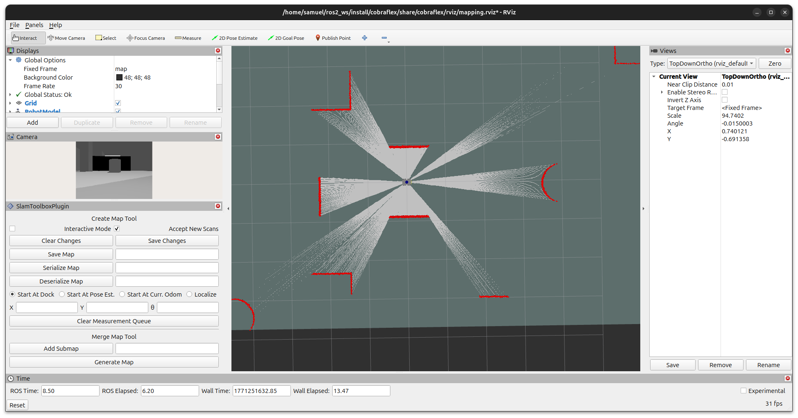<br><sub><b>SLAM Toolbox</b>: asynchronous graph SLAM, 10 Hz scans and 50 Hz odometry, pose-graph optimisation and loop closure.</sub></td>
<td width="50%">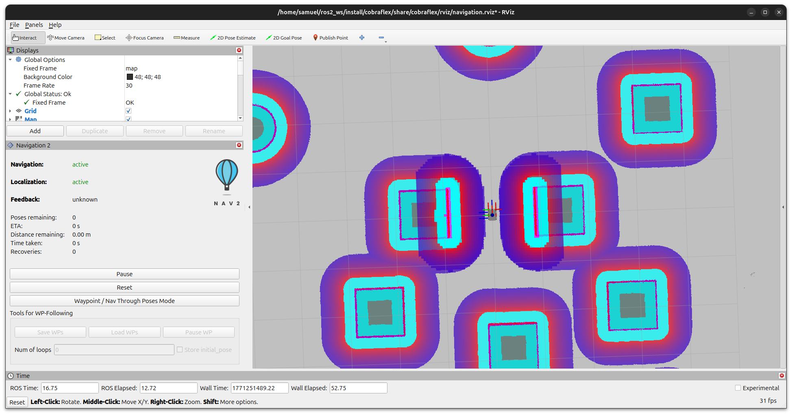<br><sub><b>Nav2</b>: NavFn global planner (Dijkstra), DWB local controller, costmaps with inflation and obstacle layers, spin/backup/wait recoveries.</sub></td>
</tr>
</table>
</div>

---

## Mathematical model

<div align="center">

</div>

The robot is a **skid-steer** vehicle modelled throughout the stack as a
differential drive. Forward and inverse kinematics:

$$
v = \frac{r(\omega_R + \omega_L)}{2}
\qquad
\omega = \frac{r(\omega_R - \omega_L)}{W}
$$

These equations describe the ideal model. With two axles 0.120 m apart, the
robot turns by dragging all four wheels sideways, which introduces a yaw gain
error not represented above. The full model quantifies this error and documents
the discrepancy with the firmware track constant.

**→ [Complete model: kinematics, control and parameters](assets/Mathematical%20Model/README.md)**

| Document | Content |
| --- | --- |
| [Kinematics](assets/Mathematical%20Model/Kinematics.md) | Geometry, forward/inverse kinematics, odometry, limits, skid-steer correction |
| [Control](assets/Mathematical%20Model/Control.md) | `/cmd_vel` chain in simulation and on hardware, plugin configuration |
| [Parameters](assets/Mathematical%20Model/parameters.md) | Mass budget, inertia tensors, sensors, SLAM profiles, firmware constants |

---

## Simulation environments

<div align="center">
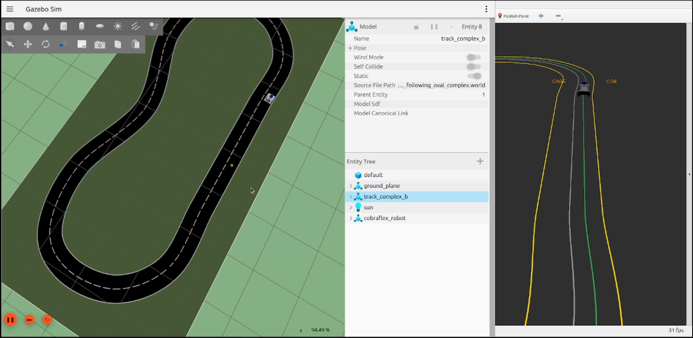
<br><sub><code>complex_b</code> circuit in Gazebo; RViz (right) shows the lane boundaries monitored by the safety cage and the active rule.</sub>
</div>

<br>

Each lane-following track is a single textured plane. All worlds of a family
share the same geometry, so differences in behaviour originate in perception.
Any world is loaded with `ros2 launch cobraflex gazebo_mesh.launch.py world:=<name>`.

| World | Purpose |
| --- | --- |
| `obstacles.world` | Default for `gazebo.launch.py`; SLAM and Nav2 |
| `oval_simple` | Low-curvature circuit; lane-keeping baseline |
| `oval_complex` | Default lane-following circuit (`complex_b`) |
| `complex_b_flipH` / `flipV` | Mirrored circuit; steering-bias test |
| `complex_b_worn_25/50/75` | Worn markings at three levels: `worn_25` strongest, `worn_75` mildest |
| `complex_b_gaps` | Lane-line dropouts |
| `complex_b_particles` | Debris and stains outside the training distribution |
| `straight_road.world` | Controller step responses |
| `empty.world` | Ground plane only; URDF bring-up |

Road textures are generated by the scripts in `materials/road_assets/`. Full
list: [`src/cobraflex/worlds/README.md`](src/cobraflex/worlds/README.md).

---

## Documentation

| Document | Content |
| --- | --- |
| **[Lab](lab/README.md)** | Lab session code completed by the students |
| **[Concepts](docs/concepts/README.md)** | Theory of each subsystem and its implementation, mapped to the lectures |
| **[Installation](docs/INSTALLATION.md)** | Machine setup, hardware dependencies, troubleshooting |
| **[Usage](docs/USAGE.md)** | SLAM, navigation, lane keeping, hardware bring-up, debugging |
| **[Mathematical Model](assets/Mathematical%20Model/README.md)** | Kinematics, control architecture, parameter reference |
| **[Teleop GUI](src/cobraflex_teleop_gui/README.md)** | Qt teleoperation window and its limits |
| **[Worlds](src/cobraflex/worlds/README.md)** | SDF worlds and texture generators |
| **[Maps](src/cobraflex/maps/README.md)** | Saving and loading occupancy grids |
| **[Gazebo Simulation](assets/Gazebo%20Simulation/README.md)** | Simulation fundamentals |

---

## Repository structure

The repository is the ROS 2 workspace root. It contains `src/`, and
`colcon build` from the top level builds all five packages.

```text
.
├── README.md
├── LICENSE                          # MIT, whole repository
├── lab/                             # Lab session code
│   └── session1/                    # emergency_brake_node.py
├── docs/
│   ├── INSTALLATION.md · USAGE.md
│   └── concepts/                    # 01-09: theory and implementation per lecture
├── assets/                          # Documentation media and CAD (not built)
│   ├── 3d-models/                   # STL / STEP for chassis and sensor mounts
│   ├── Mathematical Model/          # Kinematics, control and parameter reference
│   ├── Gazebo Simulation/           # Simulation notes
│   ├── photos/
│   └── videos/
└── src/
    ├── cobraflex/                   # Driver, description, simulation, SLAM, Nav2
    │   ├── cobraflex/               # Nodes
    │   │   ├── cobraflex_ros_driver.py      # /cmd_vel -> JSON over serial
    │   │   ├── lidar_avoidance_node.py      # /scan -> /cmd_vel avoidance
    │   │   ├── lane_keeper_node.py          # CSI camera lane keeping (hardware)
    │   │   └── lane_keeper_gazebo_node.py   # CV + pure-pursuit lane keeping (sim)
    │   ├── config/                  # EKF, SLAM Toolbox, Nav2, gz bridge, ZED
    │   ├── launch/                  # Bringup, sensors, Gazebo, mapping, navigation
    │   ├── maps/                    # Saved occupancy grids (gitignored)
    │   ├── materials/road_assets/   # Generated road textures
    │   ├── meshes/                  # Visual STLs referenced by the URDFs
    │   ├── rviz/                    # RViz layouts
    │   ├── urdf/                    # Robot descriptions, Gazebo plugins, Isaac USD
    │   └── worlds/                  # SDF worlds
    ├── cobraflex_rl/                # Lane perception, RL training/evaluation, CSI camera node
    ├── safety_cage/                 # Runtime safety monitor
    ├── cobraflex_safety_msgs/       # CageStatus.msg
    └── cobraflex_teleop_gui/        # Qt teleoperation window
```

`cobraflex` depends on `cobraflex_rl` in two places: `lane_keeper_gazebo_node`
imports `cobraflex_rl.cv_lane_controller`, and `cobraflex_sensors.launch.xml`
runs its `csi_camera_node`. The deployed controller and the evaluation
therefore execute identical code. `cobraflex_teleop_gui` is a separate package
to keep PyQt5 out of the Jetson dependencies.

---

## Related work

This repository is the platform foundation. The research built on it resides in
a separate repository:

| Repository | Content |
| --- | --- |
| **Cobra Flex** (this repository) | Robot description, simulation, driver, SLAM, Nav2, lane keeping, safety cage, laboratory |
| **Safety Cages and Safe RL** *(master's thesis)* | End-to-end camera PPO driver within a runtime safety cage, developed under an SE4AI methodology with hazard-to-evidence traceability |

Both repositories share the ROS 2 packages and the physical robot. The thesis
repository adds the RL training pipeline, a scenario library, hazard and
requirement registers, and the experimental evidence. Identifiers in code
comments (`D-43`, `SR-013`, `H-11`, `ODD-1`) refer to its records
([identifier reference](docs/concepts/README.md#identifiers)).

---

## Acknowledgements

This project is based on **[Axioma_robot](https://github.com/MrDavidAlv/Axioma_robot)**
by [MrDavidAlv](https://github.com/MrDavidAlv) — *"Robot autónomo ROS2 Humble |
SLAM + Nav2 + Gazebo | Navegación autónoma para logística industrial"*, released
under the BSD licence.

Axioma_robot is a ROS 2 Humble autonomous robot on a 4WD skid-steer chassis
with SLAM Toolbox and Nav2, the same platform class and software stack as this
project. Its documentation, in particular the structure of the mathematical
model into kinematics, control and parameters, is the basis of
[`assets/Mathematical Model/`](assets/Mathematical%20Model/README.md).

The chassis differ and no values are shared. Axioma uses a 0.0381 m wheel
radius, a 0.1679 m effective track and a 0.26 m/s top speed; this robot uses
0.03725 m, 0.154 m and 0.35 m/s. All values in this repository are derived from
its own URDFs, configuration files, firmware source and bench measurements.

---

## Author

| | |
| --- | --- |
| **Author** | Ing. Samuel Sanchez |
| **Institution** | Hochschule Esslingen |
| **Programme** | Automotive Systems M.Sc. |
| **Course** | Autonomous-driving module: ADAS (SE4ADS), SLAM, Motion Planning, Computer Vision |
| **Repository** | [snchz46/Waveshare-Cobra-Flex-ROS2-Autonomous-Car](https://github.com/snchz46/Waveshare-Cobra-Flex-ROS2-Autonomous-Car) |
| **License** | [MIT](LICENSE) |
