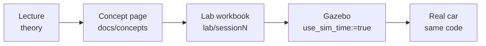
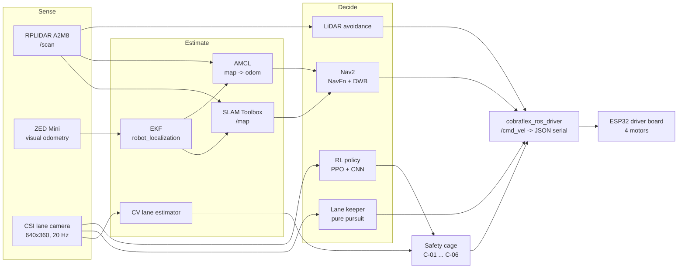
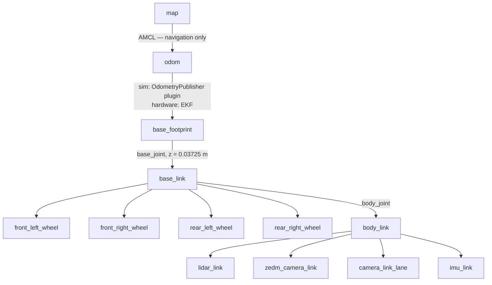

<h1 align="center">Waveshare Cobra Flex — ROS 2 Autonomous Driving Lab</h1>

<p align="center">
  <i>A 1:14 four-wheel skid-steer robot and its complete ROS 2 Humble stack — digital twin,<br>
  SLAM, Nav2, lane keeping, reinforcement learning and a runtime safety cage —<br>
  built as the hands-on platform for the autonomous-driving lab at Hochschule Esslingen.</i>
</p>

<table>
<tr>
<td width="30%" align="center"><br><sub><b>CAD</b> · Autodesk Inventor</sub></td>
<td width="30%" align="center"><br><sub><b>Digital twin</b> · Gazebo Harmonic</sub></td>
<td width="25%" align="center"><br><sub><b>Physical robot</b> · Jetson Orin Nano</sub></td>
</tr>
</table>

<p align="center">
  
  
  
  
  
  
  
  
</p>

<p align="center">
  <b><a href="#for-the-lab">For the lab</a></b> ·
  <b><a href="#quick-start">Quick start</a></b> ·
  <b><a href="#capabilities">Capabilities</a></b> ·
  <b><a href="docs/concepts/README.md">Concepts</a></b> ·
  <b><a href="#documentation">Documentation</a></b>
</p>

---

## See it in action

<div align="center">

| Lane following on the real car | Emergency stop on the real car |
|:---:|:---:|
|  |  |
| <sub>One lap of the lab circuit, steered from the lane camera</sub> | <sub>The car brakes to a halt inside its lane</sub> |

| Camera policy under the safety cage | Autonomous navigation |
|:---:|:---:|
|  |  |
| <sub>Gazebo: PPO driving <code>complex_b</code>; RViz shows the CV lane estimate and what the CNN sees</sub> | <sub>Nav2 driving to a goal in a mapped world</sub> |

| SLAM and mapping | Navigation |
|:---:|:---:|
|  |  |
| <sub>Real-time occupancy grid with SLAM Toolbox</sub> | <sub>Real-time navigation and mapping</sub> |

</div>

---

## For the lab


This repository is the foundation of the practical sessions of the
autonomous-driving module in the **Automotive Systems M.Sc.** It turns what is
taught in the lectures — ADAS (SE4ADS), SLAM, Motion Planning, Computer Vision
— into code you can run, change and break: first in Gazebo, then on the real
car, with **the same nodes and the same topics** in both.

Every concept is followed from the slide to the line of code that implements
it:

<br clear="right"/>


```mermaid
flowchart LR
    A["Lecture<br/>theory"] --> B["Concept page<br/>docs/concepts"]
    B --> C["Lab workbook<br/>lab/sessionN"]
    C --> D["Gazebo<br/>use_sim_time:=true"]
    D --> E["Real car<br/>same code"]
```

### Sessions

| # | Session | Lectures | What you work with |
| --- | --- | --- | --- |
| 1 | **ROS 2 basics and emergency braking** | ADAS (SE4ADS): ROS intro | [`lab/session1/emergency_brake_node.py`](lab/session1/emergency_brake_node.py) — fill gaps A to H, run it in Gazebo, then on the car |
| 2 | **Mapping and navigation** | SLAM · Motion Planning | SLAM Toolbox and Nav2, through your own copy of [`nav2_params.yaml`](src/cobraflex/config/nav2_params.yaml) |
| 3 | **Lane keeping and the safety cage** | Computer Vision · ADAS (SE4ADS) | The lane-keeping and safety-cage launch files, and what `/cage_status` reports |

How to run a lab script, and why it stops on an unfilled gap, is in
**[lab/README.md](lab/README.md)**. The solutions are not part of this
repository.

### Concept pages

Each page gives the theory, then points at the nodes, topics and parameters
that implement it here, the pitfalls that have bitten before, and commands to
try — **[start at the index](docs/concepts/README.md)**.

| # | Page | Lectures |
| --- | --- | --- |
| 01 | [ROS 2 foundations](docs/concepts/01_ros2_foundations.md) — nodes, topics, QoS, launch, TF, the `/cmd_vel` contract | ADAS (SE4ADS): ROS intro |
| 02 | [System architecture](docs/concepts/02_system_architecture.md) — hardware, functional levels, serial protocol | ADAS (SE4ADS) ch. 3 |
| 03 | [State estimation](docs/concepts/03_state_estimation.md) — odometry, Bayes filter, EKF, TF ownership | SLAM 03–05 |
| 04 | [SLAM and mapping](docs/concepts/04_slam_and_mapping.md) — occupancy grids, scan matching, loop closure | SLAM 06, 10, 11 |
| 05 | [Localisation and navigation](docs/concepts/05_localization_and_navigation.md) — AMCL, planners, costmaps | SLAM 09 · Motion Planning 1–3 |
| 06 | [Lane perception and control](docs/concepts/06_lane_perception_and_control.md) — camera geometry, lane detection, pure pursuit | Computer Vision L02, L03 |
| 07 | [Reinforcement learning](docs/concepts/07_reinforcement_learning.md) — MDP, PPO, CNN policy, domain randomisation | Motion Planning 3 · Computer Vision L06, L07 |
| 08 | [Safety cage](docs/concepts/08_safety_cage.md) — runtime monitoring, rules C-01 to C-06 | ADAS (SE4ADS) ch. 2, 5 |
| 09 | [Multi-machine networking](docs/concepts/09_multi_machine_networking.md) — DDS discovery, domain IDs, Wi-Fi | — |

### Before you drive the real car

- **Gazebo first.** Every exercise runs in simulation with the same topics;
  only `use_sim_time` changes.
- **One controller on `/cmd_vel`.** Whatever drives — your node, Nav2, the lane
  keeper, the teleop GUI — only one may publish at a time.
- **Never remove a deadman timer.** The driver stops the car 0.5 s after the
  last command (`cmd_timeout`); it is the only thing that stops a physical
  robot whose controller has died.
- **Your own `ROS_DOMAIN_ID`** (1–N, never 0) on the car and on its PC, or you
  will drive someone else's — see [09](docs/concepts/09_multi_machine_networking.md).
- **Know the envelope.** Nav2 plans within 0.35 m/s and 2.0 rad/s; the driver
  clamps everything to 0.53 m/s and 6.0 rad/s before it reaches the firmware.

---

## Quick start

```bash
# 1. Clone AS the workspace root -- this repo already contains src/
git clone https://github.com/snchz46/Waveshare-Cobra-Flex-ROS2-Autonomous-Car.git ~/ros2_ws
cd ~/ros2_ws && rosdep install --from-paths src --ignore-src -r -y

# 2. Build
colcon build --symlink-install && source install/setup.bash

# 3a. Mapping and navigation: start the simulation, then one tool per terminal
ros2 launch cobraflex gazebo.launch.py                  # obstacles.world
ros2 launch cobraflex_teleop_gui teleop_gui.launch.py   # drive by hand
ros2 launch cobraflex mapping.launch.py                 # SLAM + RViz
ros2 launch cobraflex navigation.launch.py              # Nav2 (needs a saved map)

# 3b. Lane following: each brings up its own world, so run one at a time
ros2 launch cobraflex lane_keeper_gazebo.launch.py      # CV estimator + pure pursuit
ros2 launch safety_cage lane_following.launch.py        # PD baseline under the safety cage
```

On the car:

```bash
ros2 launch cobraflex cobraflex_bringup.launch.xml   # description + serial driver
ros2 launch cobraflex cobraflex_sensors.launch.xml   # LiDAR + ZED Mini + CSI camera + EKF
```

Full setup in **[docs/INSTALLATION.md](docs/INSTALLATION.md)** · everyday
commands in **[docs/USAGE.md](docs/USAGE.md)**.

---

## Capabilities

Off-the-shelf chassis like the Waveshare Cobra Flex give you a solid mechanical
platform and nothing else. This repository is the missing stack, tuned for
**this** chassis rather than left on library defaults.

| Area | What it does | Where |
| --- | --- | --- |
| **Digital twin** | URDF/Xacro with inertias from a CAD assembly at measured densities; Gazebo Harmonic with LiDAR, IMU, ZED Mini (stereo RGB + depth, reprojected to a point cloud) and the CSI lane camera; a USD asset for Isaac Sim | [`urdf/`](src/cobraflex/urdf/) · [`worlds/`](src/cobraflex/worlds/) |
| **State estimation** | EKF (`robot_localization`) fusing ZED visual odometry on the car, with a single owner of `odom → base_footprint` per stack | [03](docs/concepts/03_state_estimation.md) |
| **SLAM** | SLAM Toolbox in asynchronous mode, separate profiles for simulation and real scans | [04](docs/concepts/04_slam_and_mapping.md) |
| **Navigation** | Nav2: AMCL, NavFn global planner, DWB local controller, costmaps sized to the real 0.228 × 0.180 m footprint | [05](docs/concepts/05_localization_and_navigation.md) |
| **Obstacle avoidance** | Reactive `/scan` → `/cmd_vel` node with its own scan deadman | `lidar_avoidance_node` |
| **Lane perception** | Calibrated CV lane estimator (lateral offset, heading error, curvature); histogram tracker on the CSI camera | [06](docs/concepts/06_lane_perception_and_control.md) |
| **Lane control** | Pure-pursuit steering on the CV estimate — the same code in the deployed controller and in the scored evaluation — and a PD baseline | [`cobraflex_rl`](src/cobraflex_rl/) |
| **Reinforcement learning** | PPO with a CNN on the lane camera (Stable-Baselines3), a Gazebo training environment, domain randomisation, an Isaac Sim backend, evaluation tooling | [07](docs/concepts/07_reinforcement_learning.md) |
| **Safety cage** | Runtime monitor between controller and actuators: six rules C-01 to C-06, a perception supervisor, enforcement or monitoring mode, `/cage_status` | [08](docs/concepts/08_safety_cage.md) |
| **Hardware driver** | `/cmd_vel` → JSON over USB serial to the ESP32-S3, with velocity clamps, a 0.5 s deadman and a 20 Hz keep-alive | [02](docs/concepts/02_system_architecture.md) |
| **Teleoperation** | Qt GUI with buttons, virtual joystick and sliders, plus `teleop_twist_keyboard` | [`cobraflex_teleop_gui`](src/cobraflex_teleop_gui/README.md) |
| **Multi-machine** | Car and PC on one ROS 2 graph over Wi-Fi, with rules for a lab full of cars | [09](docs/concepts/09_multi_machine_networking.md) |

Every number in the documentation is traced to the file it comes from. Where a
value is measured, assumed or still unresolved, it says so.

---

## The robot


| Parameter | Value |
| --- | --- |
| Total mass | 3.5 kg, measured |
| Footprint (L × W) | 0.228 × 0.180 m |
| Wheel radius | 0.03725 m |
| Track · wheelbase | 0.154 m · 0.120 m |
| Max linear velocity | 0.35 m/s planned · 0.53 m/s clamp |
| Max angular velocity | 2.0 rad/s planned · 6.0 rad/s clamp |
| Max acceleration | ±2.5 m/s² · ±3.2 rad/s² |

<br clear="right"/>

| Component | Part | ROS side |
| --- | --- | --- |
| Compute | NVIDIA Jetson Orin Nano Developer Kit | every on-board node |
| Chassis controller | ESP32-S3 driver board, JSON over USB serial at 115200 baud | `cobraflex_ros_driver` |
| LiDAR | Slamtec RPLIDAR A2M8 — 360°, 0.15–8 m, 10 Hz | `sllidar_ros2` |
| Stereo camera | Stereolabs ZED Mini — visual odometry and depth | `zed_wrapper` |
| Lane camera | IMX219-160 on CSI, 90° HFOV, 640 × 360 at 20 Hz | `csi_camera_node` |
| Power | 99 Wh powerbank for the Jetson; 3S Li-ion pack for the motors | `/cobraflex/battery` |

The robot is bounded **twice**, at different values: Nav2 plans inside the
first figure, and the serial driver clamps to the second before anything
reaches the firmware. Sources for every value in
[parameters.md](assets/Mathematical%20Model/parameters.md).

---

## System architecture

### Data flow


```mermaid
flowchart LR
    subgraph Sense
        L["RPLIDAR A2M8<br/>/scan"]
        Z["ZED Mini<br/>visual odometry"]
        C["CSI lane camera<br/>640x360, 20 Hz"]
    end
    subgraph Estimate
        E["EKF<br/>robot_localization"]
        S["SLAM Toolbox<br/>/map"]
        A["AMCL<br/>map -> odom"]
        V["CV lane estimator"]
    end
    subgraph Decide
        N["Nav2<br/>NavFn + DWB"]
        K["Lane keeper<br/>pure pursuit"]
        R["RL policy<br/>PPO + CNN"]
        O["LiDAR avoidance"]
    end
    G["Safety cage<br/>C-01 ... C-06"]
    D["cobraflex_ros_driver<br/>/cmd_vel -> JSON serial"]
    M["ESP32 driver board<br/>4 motors"]

    L --> S
    L --> A
    L --> O
    Z --> E
    E --> S
    E --> A
    S --> N
    A --> N
    C --> V
    C --> K
    C --> R
    V --> G
    R --> G
    N --> D
    K --> D
    O --> D
    G --> D
    D --> M
```

Only one controller drives at a time, and every one of them ends at the same
interface: a `geometry_msgs/Twist` on `/cmd_vel` carrying `linear.x` and
`angular.z`. In simulation the Gazebo `DiffDrive` plugin consumes it; on the
car `cobraflex_ros_driver` clamps it, guards it with a deadman and re-sends it
at 20 Hz.

### The safety-cage chain

<div align="center">

<br><sub>Perception and policy never touch the wheels directly: the policy's <code>/raw_action</code> passes through the cage, which applies its rules in a fixed order and hands <code>/safe_action</code> to vehicle control. Details in <a href="docs/concepts/08_safety_cage.md">08 · Safety cage</a>.</sub>
</div>

### Transform tree


```mermaid
graph TD
    mapf["map"] -->|"AMCL — navigation only"| odomf["odom"]
    odomf -->|"sim: OdometryPublisher plugin<br/>hardware: EKF"| bf["base_footprint"]
    bf -->|"base_joint, z = 0.03725 m"| bl["base_link"]
    bl --> wfl["front_left_wheel"]
    bl --> wfr["front_right_wheel"]
    bl --> wrl["rear_left_wheel"]
    bl --> wrr["rear_right_wheel"]
    bl -->|"body_joint"| body["body_link"]
    body --> lidar["lidar_link"]
    body --> zed["zedm_camera_link"]
    body --> lane["camera_link_lane"]
    body --> imu["imu_link"]
```

> **Exactly one node may publish `odom -> base_footprint`,** and which one
> differs per stack — the ground-truth `OdometryPublisher` in simulation, the
> EKF on hardware. Three publishers once fought over that edge and RViz jumped
> every cycle. The DiffDrive plugin's dead-reckoning TF is therefore diverted to
> `tf_diffdrive`, and `ekf_gazebo.yaml` sets `publish_tf: false`.

### SLAM and navigation

<div align="center">
<table>
<tr>
<td width="50%"><br><sub><b>SLAM Toolbox</b> — asynchronous graph SLAM, 10 Hz scans against 50 Hz odometry, with pose-graph optimisation and loop closure.</sub></td>
<td width="50%"><br><sub><b>Nav2</b> — NavFn global planner (Dijkstra), DWB local controller, dynamic costmaps with inflation and obstacle layers, plus spin/backup/wait recoveries.</sub></td>
</tr>
</table>
</div>

---

## Mathematical model

<div align="center">

</div>

The robot is a **skid-steer** treated throughout the stack as a differential
drive. Forward and inverse kinematics:

$$
v = \frac{r(\omega_R + \omega_L)}{2}
\qquad
\omega = \frac{r(\omega_R - \omega_L)}{W}
$$

That is the ideal model. With two axles 0.120 m apart the robot can only turn by
dragging all four wheels sideways, so the yaw channel carries a gain error the
equations above do not represent — quantified, with the open question about the
firmware's disagreeing track constant, in the full write-up.

**→ [Complete model: kinematics, control and parameters](assets/Mathematical%20Model/README.md)**

| Document | Covers |
| --- | --- |
| [Kinematics](assets/Mathematical%20Model/Kinematics.md) | Geometry, forward/inverse kinematics, odometry, limits, skid-steer correction |
| [Control](assets/Mathematical%20Model/Control.md) | The `/cmd_vel` chain in simulation and on hardware, plugin configuration |
| [Parameters](assets/Mathematical%20Model/parameters.md) | Mass budget, inertia tensors, sensors, SLAM profiles, firmware constants |

---

## Simulation environments

<div align="center">

<br><sub>The <code>complex_b</code> circuit in Gazebo; RViz (right) draws the lane boundaries the cage watches and the rule that is currently active.</sub>
</div>

<br>

The lane-following track is a single textured plane — the *appearance* of the
road **is** the texture. The geometry is identical across a family, so any
difference in behaviour comes from perception rather than from the path. Load
any of them with `ros2 launch cobraflex gazebo_mesh.launch.py world:=<name>`.

| World | Purpose |
| --- | --- |
| `obstacles.world` | Default for `gazebo.launch.py` — SLAM and Nav2 |
| `oval_simple` | Gentler circuit, the easy lane-keeping baseline |
| `oval_complex` | Default lane-following circuit (`complex_b`) |
| `complex_b_flipH` / `flipV` | Same circuit mirrored — exposes a steering bias |
| `complex_b_worn_25/50/75` | Paint degraded 25/50/75 % — the degradation sweep |
| `complex_b_gaps` | Line dropouts — how the estimator holds through a gap |
| `complex_b_particles` | Debris and stains on the road that no controller was trained on |
| `straight_road.world` | Controller step responses |
| `empty.world` | Ground plane only, for URDF bring-up debugging |

Road textures are **generated**, not hand-painted, by the scripts under
`materials/road_assets/`. Full list:
[`src/cobraflex/worlds/README.md`](src/cobraflex/worlds/README.md).

---

## Documentation

| Document | Contents |
| --- | --- |
| **[Lab](lab/README.md)** | Code for the lab sessions: the half-made nodes students complete in their workbooks |
| **[Concepts](docs/concepts/README.md)** | The theory behind each subsystem and where this repository implements it, linked to the lectures |
| **[Installation](docs/INSTALLATION.md)** | Clean-machine setup, hardware-only dependencies, troubleshooting |
| **[Usage](docs/USAGE.md)** | SLAM, navigation, lane keeping, physical bring-up, debugging |
| **[Mathematical Model](assets/Mathematical%20Model/README.md)** | Kinematics, control architecture, full parameter reference |
| **[Teleop GUI](src/cobraflex_teleop_gui/README.md)** | The Qt driving window, its limits and why it publishes on `/cmd_vel` |
| **[Worlds](src/cobraflex/worlds/README.md)** | Every SDF world and the texture generators |
| **[Maps](src/cobraflex/maps/README.md)** | Saving and loading occupancy grids |
| **[Gazebo Simulation](assets/Gazebo%20Simulation/README.md)** | Simulation setup fundamentals |

---

## Repository structure

The repository **is** the ROS 2 workspace root: it carries `src/`, and
`colcon build` from the top level picks up all five packages.

```text
.
├── README.md
├── LICENSE                          # MIT, applies to the whole repository
├── lab/                             # Lab session code students complete
│   └── session1/                    # emergency_brake_node.py
├── docs/
│   ├── INSTALLATION.md · USAGE.md
│   └── concepts/                    # 01-09: theory -> implementation, per lecture
├── assets/                          # Documentation media and CAD, not built
│   ├── 3d-models/                   # STL / STEP for chassis and sensor mounts
│   ├── Mathematical Model/          # Kinematics, control and parameter reference
│   ├── Gazebo Simulation/           # Simulation setup notes
│   ├── photos/
│   └── videos/
└── src/
    ├── cobraflex/                   # Driver, description, simulation, SLAM, Nav2
    │   ├── cobraflex/               # Nodes
    │   │   ├── cobraflex_ros_driver.py      # /cmd_vel -> JSON over serial
    │   │   ├── lidar_avoidance_node.py      # /scan -> /cmd_vel avoidance
    │   │   ├── lane_keeper_node.py          # CSI camera lane keeping (hardware)
    │   │   └── lane_keeper_gazebo_node.py   # CV + pure-pursuit lane keeping (sim)
    │   ├── config/                  # EKF, SLAM Toolbox, Nav2, gz bridge, ZED
    │   ├── launch/                  # Bringup, sensors, Gazebo, mapping, navigation
    │   ├── maps/                    # Saved occupancy grids (gitignored)
    │   ├── materials/road_assets/   # Generated road textures for the sim worlds
    │   ├── meshes/                  # Visual STLs referenced by the URDFs
    │   ├── rviz/                    # RViz layouts
    │   ├── urdf/                    # Robot descriptions, Gazebo plugins, Isaac USD
    │   └── worlds/                  # SDF worlds
    ├── cobraflex_rl/                # Lane perception, RL training/eval, CSI camera node
    ├── safety_cage/                 # Runtime safety monitor over the controllers
    ├── cobraflex_safety_msgs/       # CageStatus.msg (CMake / message generation)
    └── cobraflex_teleop_gui/        # Qt window for driving by hand
```

`cobraflex` depends on `cobraflex_rl` in two places, deliberately:
`lane_keeper_gazebo_node` imports `cobraflex_rl.cv_lane_controller`, and
`cobraflex_sensors.launch.xml` runs its `csi_camera_node`. The sharing is the
point — the deployed controller and the scored evaluation run identical code.
`cobraflex_teleop_gui` is a separate package so that PyQt5 never becomes a
dependency of the Jetson.

---

## Related work

This repository is the **platform foundation**. The research built on top of it
lives in a separate repository:

| Repository | What it adds |
| --- | --- |
| **Cobra Flex** (here) | The robot and its stack: description, simulation, driver, SLAM, Nav2, lane keeping, safety cage — and the lab |
| **Safety Cages and Safe RL** *(master's thesis)* | An end-to-end camera PPO driver wrapped in a runtime safety cage, developed under an SE4AI methodology with full hazard-to-evidence traceability |

The two share the same ROS 2 packages and the same physical robot. The thesis
repository extends them with the RL training pipeline, a scenario library,
hazard and requirement registers, and the experimental evidence. The IDs you
meet in comments — `D-43`, `SR-013`, `H-11`, `ODD-1` — point into its records
([how to read them](docs/concepts/README.md#reading-the-ids)).

---

## Acknowledgements

This project started from **[Axioma_robot](https://github.com/MrDavidAlv/Axioma_robot)**
by [MrDavidAlv](https://github.com/MrDavidAlv) — *"Robot autónomo ROS2 Humble |
SLAM + Nav2 + Gazebo | Navegación autónoma para logística industrial"*, released
under the BSD licence.

Axioma_robot is a ROS 2 Humble autonomous robot built on a 4WD skid-steer
chassis with SLAM Toolbox and Nav2 — the same class of platform and the same
software stack as this one — and it is where the idea for this project came
from. Its documentation, in particular the way the robot's mathematical model is
organised into kinematics, control and parameters, is the direct basis for
[`assets/Mathematical Model/`](assets/Mathematical%20Model/README.md).

The two robots are **different chassis**, and none of the numbers carry over:
Axioma runs a 0.0381 m wheel radius, a 0.1679 m effective track and a 0.26 m/s
top speed, against 0.03725 m, 0.154 m and 0.35 m/s here. Every figure in this
repository's documentation has been re-derived from its own URDFs, configuration
files, firmware source and bench measurements.

Thanks to MrDavidAlv for publishing the work openly.

---

## Author

| | |
| --- | --- |
| **Author** | Ing. Samuel Sanchez |
| **Institution** | Hochschule Esslingen |
| **Programme** | Automotive Systems M.Sc. |
| **Used in** | Lab of the autonomous-driving module — ADAS (SE4ADS), SLAM, Motion Planning, Computer Vision |
| **Repository** | [snchz46/Waveshare-Cobra-Flex-ROS2-Autonomous-Car](https://github.com/snchz46/Waveshare-Cobra-Flex-ROS2-Autonomous-Car) |
| **License** | [MIT](LICENSE) — free for academic, research and commercial use |
