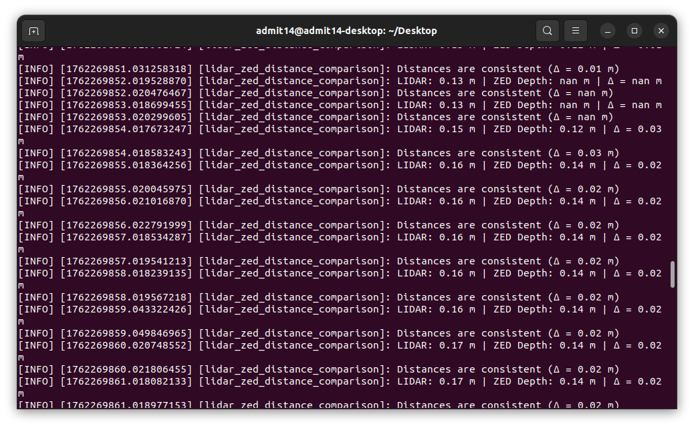
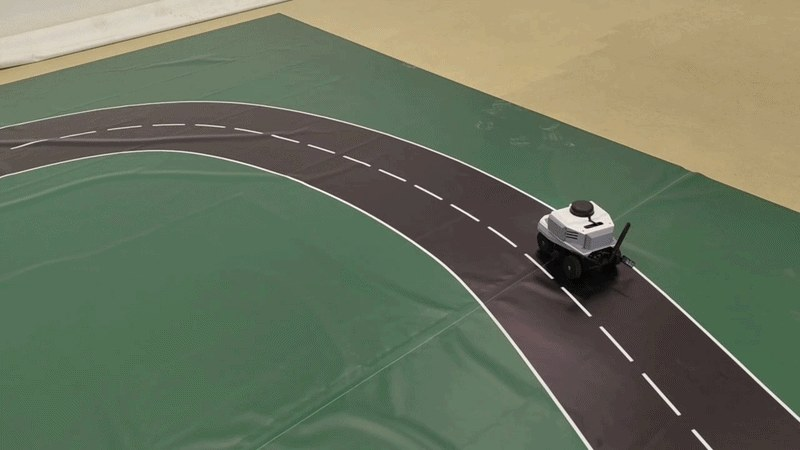
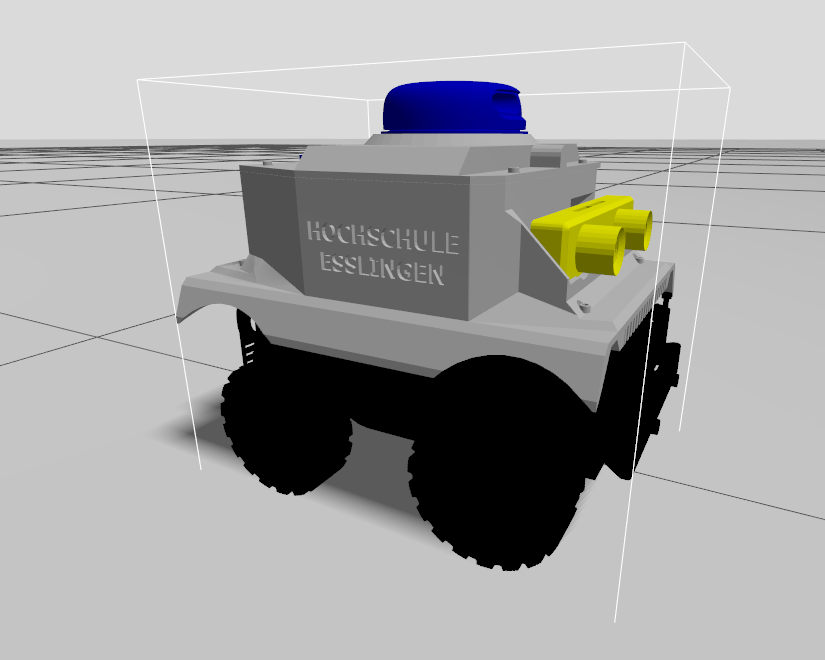
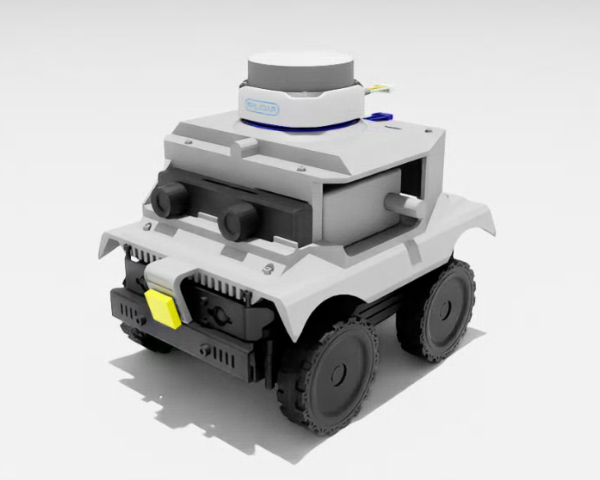
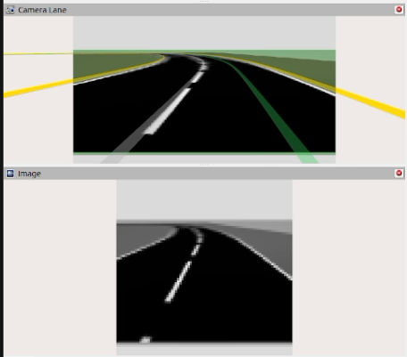

# Photo Gallery

High-resolution build photos and documentation shots live here. Embed them directly into Markdown files using relative links so the visuals travel with the repository.

| Snapshot | Caption |
| --- | --- |
|  | First bench-top wiring pass with the Jetson, ZED Mini, and RPLIDAR mounted to the Cobra Flex chassis. |
|  | Side angle of the early stack showing sensor spacing and temporary cable management. |
|  | Version 1 mockup with refined plate geometry and a centered ZED Mini bracket. |
|  | Rear of the V1 layout highlighting power distribution and lidar positioning. |
|  | Side profile of the V1 iteration showing lowered center of gravity and cleaner wiring routes. |
|  | Jetson Orin Nano developer kit mounted on the Waveshare Cobra Flex chassis during wiring. |
|  | Early alignment check for the ZED Mini stereo camera and RPLIDAR A2M8. |
|  | Side-by-side comparison of mounting plate revisions. |
|  | RViz capture illustrating fused LiDAR and ZED data. |
|  | Analysis plot comparing range measurements from both sensors. |
|  | Current (V3) build on the lab circuit: RPLIDAR, ZED Mini, CSI lane camera on the front bumper. |
|  | The lab circuit, a still from the physical emergency-stop clip. |
|  | The robot model in Gazebo Harmonic, cropped from `digital_twin.png`. |
|  | The robot's USD asset rendered in NVIDIA Isaac Sim. |
|  | `complex_b` circuit in Gazebo, with RViz drawing the lane boundaries the safety cage watches. |
|  | Lane camera in RViz: CV lane estimate overlay and the grayscale frame the CNN policy sees. |
|  | Perception → policy → safety cage → vehicle control, with the topics between them. |

When adding new media:
1. Place the file in this directory (or a dated subfolder).
2. Use web-friendly names (lowercase, spaces allowed) so GitHub renders them cleanly.
3. Reference the image with Markdown syntax: ``.
4. Update any relevant documentation (`README.md`, `docs/`, or experiment logs) so readers can see the new visuals in context.

For large photo dumps, create a subfolder (for example, `2024-06-trackday/`) with its own `README.md` summarizing the highlights.
