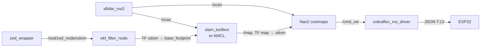
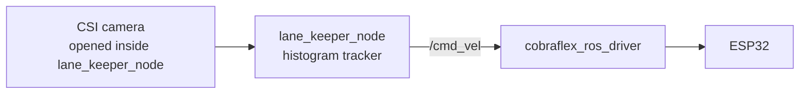
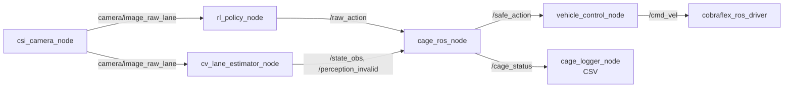

# 02 · System architecture

> **In one sentence:** the Cobra Flex is a small automated-driving system whose
> functional levels — navigation, trajectory planning, stabilisation — map onto
> Nav2, the lane and RL controllers, and the chassis firmware, with a safety
> cage and deadman timers watching the chain.

[← 01 ROS 2 foundations](01_ros2_foundations.md) · [Concepts](README.md) · Next: [03 State estimation →](03_state_estimation.md)

---

## Concept

An automated driving system is described twice:

- **Physical architecture** — compute, E/E (power, buses), sensors and
  actuators, the "mechatronic perspective".
- **Functional architecture** — what the system does, independent of hardware.
  Driver models split the driving task into three levels: **navigation**
  (which route), **trajectory planning** (how to move over the next seconds)
  and **vehicle stabilisation** (track the commanded motion in closed loop).
  Navigation and trajectory planning are anticipatory; stabilisation is
  feedback control.

Perception and state estimation feed all three levels. A supervisor that can
override the controller sits between planning and actuation.

---

## In this repository

### Functional levels

| Level | Question | Cobra Flex implementation |
| --- | --- | --- |
| Navigation | Where to go, along which route? | Nav2 behaviour tree + NavFn global planner on the saved map ([05](05_localization_and_navigation.md)) |
| Trajectory planning | Which `v`, `ω` now? | DWB local controller, classical lane keeper (pure pursuit), RL policy ([05](05_localization_and_navigation.md), [06](06_lane_perception_and_control.md), [07](07_reinforcement_learning.md)) |
| Stabilisation | Make the wheels do it | ESP32 firmware turning `/cmd_vel` into wheel speeds ([Control](../../assets/Mathematical%20Model/Control.md)) |
| Supervision | Is the command safe? | Safety cage ([08](08_safety_cage.md)), deadman timers in the driver and the LiDAR node |
| Perception and estimation | Where am I, what is around? | EKF, SLAM Toolbox, AMCL, CV lane estimator ([03](03_state_estimation.md), [04](04_slam_and_mapping.md), [06](06_lane_perception_and_control.md)) |

### Physical architecture

| Component | Part | Interface | ROS side |
| --- | --- | --- | --- |
| Compute | NVIDIA Jetson Orin Nano Developer Kit | — | every on-board node |
| Chassis controller | ESP32-S3 driver board | USB serial, 115200 baud, JSON lines | `cobraflex_ros_driver` |
| LiDAR | Slamtec RPLIDAR A2M8, 360°, 10 Hz | USB serial | `sllidar_ros2` |
| Stereo camera | Stereolabs ZED Mini | USB 3 | `zed_wrapper` (`camera_model:=zedm`) |
| Lane camera | IMX219-160 on CSI, 90° HFOV | CSI, GStreamer `nvarguscamerasrc` | `csi_camera_node` or `lane_keeper_node` |
| Power | Powerbank XTPower XT-27000 (99 Wh) for the Jetson; 3S Li-ion pack for the motors | DC | battery voltage on `/cobraflex/battery` |

Measured mass is 3.5 kg; the split per component and every other physical
number live in [parameters.md](../../assets/Mathematical%20Model/parameters.md).

### The serial protocol

[`cobraflex_ros_driver.py`](../../src/cobraflex/cobraflex/cobraflex_ros_driver.py)
speaks newline-terminated JSON to the ESP32:

| Direction | Message | Meaning |
| --- | --- | --- |
| PC → ESP32 | `{"T": 13, "X": vx, "Z": wz}` | Velocity command (m/s, rad/s), re-sent every 50 ms |
| PC → ESP32 | `{"T": 131, "cmd": 1}` | Start the feedback stream |
| PC → ESP32 | `{"T": 132, "IO1": l, "IO2": r}` | Lights |
| ESP32 → PC | `{"T": 1001, ...}` | Feedback: cumulative wheel distances `odl`/`odr` (integer cm), battery `v` (centivolts) |

The driver republishes feedback on `/cobraflex/feedback` (raw JSON),
`/cobraflex/battery` and `/cobraflex/wheel_speeds` (a `Twist`, not
`nav_msgs/Odometry` — which is why the EKF uses the ZED's visual odometry,
[03](03_state_estimation.md)). The firmware converts `X`/`Z` into wheel speeds
with its own track constant, which disagrees with the URDF by about 3 %
([parameters.md §1.4](../../assets/Mathematical%20Model/parameters.md)).

### Node graph per use case

**Mapping and navigation on the car**



**Classical lane keeping on the car**



**RL policy behind the safety cage** (from the
[`rl_policy_node.py`](../../src/cobraflex_rl/cobraflex_rl/rl_policy_node.py)
docstring)



### Main topics

| Topic | Type | From → to |
| --- | --- | --- |
| `/scan` | `sensor_msgs/LaserScan` | LiDAR → SLAM, AMCL, costmaps, avoidance |
| `/zed/zed_node/odom` | `nav_msgs/Odometry` | ZED → EKF |
| `/odometry/filtered` | `nav_msgs/Odometry` | EKF → cage speed, analysis |
| `camera/image_raw_lane` | `sensor_msgs/Image` | CSI camera → RL policy, CV estimator |
| `/map` | `nav_msgs/OccupancyGrid` | SLAM Toolbox or map server → Nav2 |
| `/cmd_vel` | `geometry_msgs/Twist` | The one active controller → driver |
| `/raw_action`, `/safe_action` | `geometry_msgs/Twist` | Policy → cage → vehicle control |
| `/state_obs` | `std_msgs/Float64MultiArray` | CV estimator → cage |
| `/cage_status` | `cobraflex_safety_msgs/CageStatus` | Cage → logger, RViz, you |
| `/cobraflex/battery`, `/cobraflex/wheel_speeds` | `Float32`, `Twist` | Driver → monitoring |

### Speed limits are set twice

Nav2 plans inside 0.35 m/s and 2.0 rad/s
([`nav2_params.yaml`](../../src/cobraflex/config/nav2_params.yaml)); the driver
clamps everything to 0.53 m/s and 6.0 rad/s before it reaches the firmware.
The lane-following ODD caps speed at 0.5 m/s through cage rule C-04
([08](08_safety_cage.md)).

---

## Pitfalls

- **The lane camera has one owner.** `cobraflex_sensors.launch.xml` opens the
  CSI camera by default; `nvarguscamerasrc` cannot share it. The classical lane
  keeper opens the camera inside `lane_keeper_node`, so start the sensors with
  `use_lane_camera:=false` when you use it. The RL deploy launch attaches to
  `camera/image_raw_lane` instead (`camera:=false`).
- **The cage needs the EKF.** On the car `/odometry/filtered` is the only speed
  source for the cage; without layer 2, rules C-03, C-04 and C-05's
  high-energy trigger go silently inert.

---

## Try it

```bash
# Car, three terminals (see Usage §5)
ros2 launch cobraflex cobraflex_bringup.launch.xml
ros2 launch cobraflex cobraflex_sensors.launch.xml
ros2 launch cobraflex cobraflex_automatic.launch.xml      # or another Layer-3 controller

# From the lab PC
ros2 topic echo /cobraflex/battery
ros2 topic echo /cobraflex/feedback --once
rqt_graph
```

---

## Lecture links

- **ADAS (SE4ADS) chapter 3** — physical architectures (mechatronic, E/E,
  software) and functional architectures (driver-model levels); compare the
  table above with the functional reference architecture of the lecture.
- **ADAS (SE4ADS) chapter 4** — the ADAS functions the lab rebuilds at small
  scale: emergency braking (LiDAR stop), lane keeping.

## Further reading

- Waveshare Cobra Flex chassis: <https://www.waveshare.com/product/robotics/mobile-robots/jetson-series-ai-robots/cobra-flex.htm>
- `sllidar_ros2`: <https://github.com/Slamtec/sllidar_ros2>
- ZED ROS 2 wrapper: <https://github.com/stereolabs/zed-ros2-wrapper>
