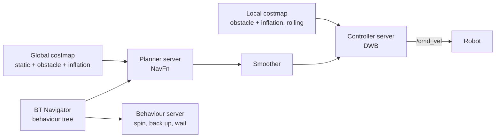

# 05 · Localisation and navigation

> **Summary:** on a saved map, AMCL localises the robot with a particle filter,
> NavFn plans a global path on the costmap, and DWB samples collision-free
> velocity commands along it. The Nav2 behaviour tree coordinates all three.

[← 04 SLAM and mapping](04_slam_and_mapping.md) · [Concepts](README.md) · Next: [06 Lane perception and control →](06_lane_perception_and_control.md)

---

## Theory

### Monte Carlo localisation (AMCL)

The belief over the pose is a set of weighted samples (particles). Each cycle:

1. **Prediction**: every particle is moved by the odometry increment plus
   motion-model noise.
2. **Weighting**: every particle is scored by the agreement between the
   current scan and the map from that pose. The *likelihood field* model looks
   up, for each beam endpoint, the distance to the nearest obstacle in the map.
3. **Resampling**: a new set is drawn in proportion to the weights.

*Adaptive* MCL varies the number of particles with the spread of the belief
(KLD sampling): many particles while the pose is uncertain, few after
convergence.

### Nav2 structure



### Global planning: Dijkstra and A*

The global costmap is a graph: cells are nodes, neighbouring cells are
connected by edges, and the cell cost is the edge weight. **Dijkstra** expands
nodes in order of the cost $g$ from the start. **A*** expands in order of
$f = g + h$, where $h$ estimates the remaining cost to the goal. With an
admissible heuristic (one that never overestimates, such as the straight-line
distance), A* returns the same optimal path while expanding fewer nodes. NavFn
computes a navigation function from the goal with Dijkstra by default;
`use_astar` selects A*.

### Costmaps and inflation

A costmap consists of layers: the **static** layer (saved map), the
**obstacle** layer (live scans mark obstacles and clear free space by ray
tracing) and the **inflation** layer, which spreads cost around obstacles to
keep a safety margin. Within the inscribed radius of the robot the cost is 253
(certain collision); beyond it, up to `inflation_radius`, it decays as

$$
\text{cost}(d) = 252 \cdot e^{-k\,(d - r_{\text{inscribed}})}
$$

with $k$ = `cost_scaling_factor`. A larger $k$ allows paths close to obstacles;
a smaller $k$ moves them towards the centre of free space.

### Local control: dynamic window

DWB samples pairs $(v_x, \omega_z)$ reachable within the acceleration limits
during the next control period (the *dynamic window*), simulates each pair
forward for `sim_time` seconds, scores each resulting trajectory with a
weighted sum of **critics** (distance to the path, alignment with the goal,
obstacle cost, among others) and sends the best pair. This is repeated at the
controller frequency.

### Behaviour trees

Nav2 encodes the sequence "plan, follow, recover" as a behaviour tree: a tree
of conditions and actions ticked from the root. It fulfils the role of state
machines and state charts in behaviour planning and is extended with recovery
actions such as spinning or backing up.

---

## Implementation

All parameters are in [`nav2_params.yaml`](../../src/cobraflex/config/nav2_params.yaml),
loaded by [`navigation.launch.py`](../../src/cobraflex/launch/navigation.launch.py)
together with the map server, AMCL and RViz.

**AMCL**

| Parameter | Value | Meaning |
| --- | --- | --- |
| `robot_model_type` | `DifferentialMotionModel` | Skid-steer modelled as differential drive |
| `alpha1`…`alpha5` | 0.2 each | Motion-model noise |
| `laser_model_type` | `likelihood_field` | Sensor model |
| `min_particles` / `max_particles` | 500 / 2000 | KLD-sampling bounds |
| `update_min_d` / `update_min_a` | 0.05 m / 0.2 rad | Motion before a filter update |
| `laser_max_range` | 8.0 m | Maximum beam range used |

**Planner and smoother**

| Parameter | Value |
| --- | --- |
| Planner plugin | `nav2_navfn_planner/NavfnPlanner` (`GridBased`) |
| `use_astar` | `false` (Dijkstra) |
| `tolerance` | 0.25 m |
| `allow_unknown` | `true` |
| Smoother | `nav2_smoother::SimpleSmoother` |

**Controller (DWB)**, `controller_frequency` 20 Hz

| Parameter | Value |
| --- | --- |
| `min_vel_x` / `max_vel_x` | −0.15 / 0.35 m/s |
| `max_vel_theta` | 2.0 rad/s |
| `acc_lim_x` / `acc_lim_theta` | 2.5 m/s² / 3.2 rad/s² |
| `vx_samples` × `vtheta_samples` | 20 × 20 |
| `sim_time` | 1.5 s |
| Critics (scale) | RotateToGoal, Oscillation, BaseObstacle (0.02), PathAlign (32), PathDist (32), GoalAlign (24), GoalDist (24) |
| Goal tolerance | 0.05 m, 0.10 rad |

**Costmaps**, resolution 0.025 m, footprint 0.228 × 0.180 m

| | Local | Global |
| --- | --- | --- |
| Layers | obstacle, inflation | static, obstacle, inflation |
| Size | Rolling window 2 × 2 m | Map extent |
| Update / publish | 5 Hz / 2 Hz | 1 Hz / 1 Hz |
| `inflation_radius` | 0.30 m | 0.30 m |
| `cost_scaling_factor` | 3.0 | 3.0 |
| Obstacle range / ray trace | 6.0 m / 8.0 m | 6.0 m / 8.0 m |

The footprint has an inscribed radius of 0.090 m and a circumscribed radius of
0.145 m; the 0.30 m inflation therefore keeps a margin of about 0.2 m beyond
the side of the robot.

**Behaviours:** spin, back up, drive on heading, assisted teleoperation, wait.

---

## Common errors

- **Simulation time on the robot.** `navigation.launch.py` defaults to
  `use_sim_time:=true`. On the robot, `use_sim_time:=false` is required. The
  launch file has to be verified on hardware before a lab session relies on it.
- **Missing initial pose.** AMCL starts without a pose estimate; the pose is
  set with *2D Pose Estimate* in RViz before the first goal.
- **Missing map.** The launch file expects `cobraflex_map.yaml` in
  `src/cobraflex/maps` unless `map:=` is given.
- **Tight goal tolerance.** 0.05 m is small compared with the odometry drift of
  the robot; near the goal the robot may oscillate.
- **Two velocity limits.** Nav2 plans within 0.35 m/s and 2.0 rad/s; the
  driver clamps at 0.53 m/s and 6.0 rad/s ([02](02_system_architecture.md)).

---

## Commands

```bash
# Gazebo, with a saved map (see Usage §2)
ros2 launch cobraflex gazebo.launch.py
ros2 launch cobraflex navigation.launch.py
# RViz: 2D Pose Estimate, then Nav2 Goal
```

Exercises:

1. Set `use_astar: true` in `nav2_params.yaml`, relaunch (rebuild first unless
   the workspace was built with `--symlink-install`) and compare path and
   planning time with Dijkstra for the same start and goal.
2. Reduce `inflation_radius` to 0.15 m and compare the resulting paths.
3. Drive into a dead end and observe the recovery actions of the behaviour
   tree.

---

## Lecture references

- **SLAM 09**: particle filters and Monte Carlo localisation; AMCL is MCL with
  adaptive sample size.
- **Motion Planning part 1**: graph search and A*; NavFn on the costmap.
- **Motion Planning part 2**: sampling-based and optimisation-based planning
  (PRM, RRT, MPC), in contrast with the sampled velocities of DWB.
- **Motion Planning part 3**: behaviour planning with state machines, compared
  with the Nav2 behaviour tree.

## Further reading

- Nav2 documentation: <https://docs.nav2.org>
- Nav2 costmap and inflation tuning guide: <https://docs.nav2.org/tuning/index.html>
- D. Fox, W. Burgard, S. Thrun, "The dynamic window approach to collision avoidance", *IEEE Robotics & Automation Magazine*, 1997.
