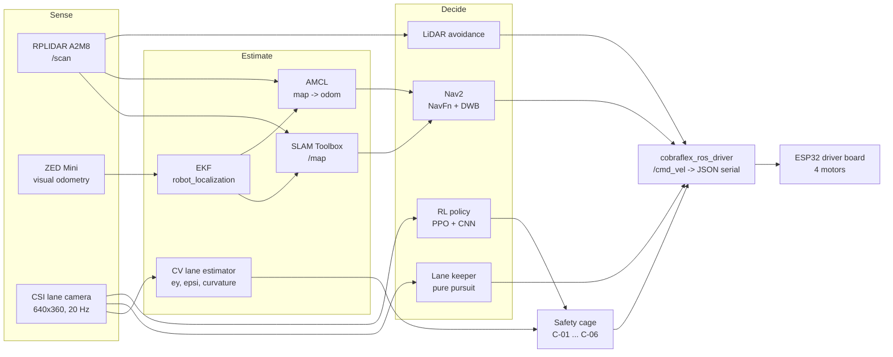

# Concepts — how the Cobra Flex is built

These pages explain the theory behind each part of the stack and then show
where and how this repository implements it. They are the reference for the
ROS 2 lab: when an exercise says "switch NavFn to A*" or "read `/cage_status`",
the page here says what that means, which file sets it and why it has the value
it has.

Every page follows the same shape:

| Section | What it gives you |
| --- | --- |
| **Concept** | The theory, limited to what the stack actually uses |
| **In this repository** | Nodes, topics, launch files and parameters, each value linked to the file that sets it |
| **Pitfalls** | Invariants that have broken before, and how to recognise them |
| **Try it** | Commands for Gazebo and for the car |
| **Lecture links** | Where the theory is taught in the module: ADAS (SE4ADS), SLAM, Motion Planning, Computer Vision |

---

## The system on one page

Only one controller drives at a time. Whatever it is, it ends in a
`geometry_msgs/Twist` on `/cmd_vel`, which the serial driver clamps, guards with
a deadman timer and sends to the chassis ([01](01_ros2_foundations.md),
[Control](../../assets/Mathematical%20Model/Control.md)).

---

## Pages

| # | Page | Explains | Lecture links |
| --- | --- | --- | --- |
| 01 | [ROS 2 foundations](01_ros2_foundations.md) | Nodes, topics, QoS, launch layers, TF, the `/cmd_vel` contract | ADAS (SE4ADS): ROS intro |
| 02 | [System architecture](02_system_architecture.md) | Hardware, functional levels, node graph per use case, serial protocol | ADAS (SE4ADS) ch. 3 |
| 03 | [State estimation](03_state_estimation.md) | Odometry, Bayes filter, EKF, TF ownership | SLAM 03, 04, 05 |
| 04 | [SLAM and mapping](04_slam_and_mapping.md) | Occupancy grids, scan matching, pose graphs, loop closure | SLAM 06, 10, 11 |
| 05 | [Localisation and navigation](05_localization_and_navigation.md) | AMCL, Nav2 planner, controller, costmaps, behaviours | SLAM 09, Motion Planning parts 1–3 |
| 06 | [Lane perception and control](06_lane_perception_and_control.md) | Camera geometry, classical lane detection, pure pursuit | Computer Vision L02, L03 |
| 07 | [Reinforcement learning](07_reinforcement_learning.md) | MDP, PPO, CNN policy, reward, domain randomisation, deployment | Motion Planning part 3, Computer Vision L06, L07 |
| 08 | [Safety cage](08_safety_cage.md) | Runtime monitoring, rules C-01 to C-06, perception supervision | ADAS (SE4ADS) ch. 2, ch. 5 |
| 09 | [Multi-machine networking](09_multi_machine_networking.md) | DDS discovery, domain IDs, Wi-Fi bandwidth, time sync | — |

The lecture numbers refer to the module of the Automotive Systems master at
Hochschule Esslingen that the lab belongs to: *Systems Engineering for
Autonomous Driving Systems* (chapters), *SLAM* (lecture files 01–11),
*Motion Planning* (parts 1–3) and *Computer Vision and Deep Learning*
(lectures L01–L09).

## Already documented elsewhere

These pages link to the existing documents instead of repeating them:

| Document | Covers |
| --- | --- |
| [Kinematics](../../assets/Mathematical%20Model/Kinematics.md) | Skid-steer geometry, forward and inverse kinematics, odometry integration |
| [Control](../../assets/Mathematical%20Model/Control.md) | The `/cmd_vel` chain in Gazebo and on the car |
| [Parameters](../../assets/Mathematical%20Model/parameters.md) | Mass, inertia, sensors, limits, firmware constants |
| [Installation](../INSTALLATION.md) · [Usage](../USAGE.md) | Setting up a machine, everyday commands |
| [Worlds](../../src/cobraflex/worlds/README.md) · [Maps](../../src/cobraflex/maps/README.md) | Simulation worlds and saved maps |

## Reading the IDs

Comments and docstrings carry IDs such as `D-43`, `SR-013`, `H-11` or `ODD-1`.
They point into the engineering records of the master's thesis built on this
platform (see *Related work* in the [root README](../../README.md)): `D-` is a
design decision, `SR-` a safety requirement, `H-` a hazard and `ODD-1` the
operational design domain the lane-following work assumes.
