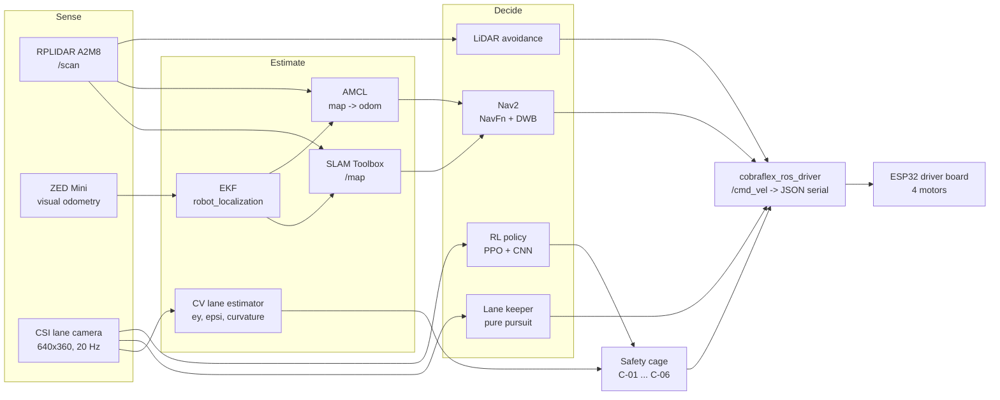

# Concepts

These pages present the theory behind each subsystem of the stack and its
implementation in this repository. They are the reference for the ROS 2 lab:
each exercise instruction (for example "switch NavFn to A*" or "read
`/cage_status`") is explained here, together with the file that defines the
setting and the rationale for its value.

All pages share the same structure:

| Section | Content |
| --- | --- |
| **Theory** | Theoretical background, limited to the methods used in the stack |
| **Implementation** | Nodes, topics, launch files and parameters, each linked to its source file |
| **Common errors** | Known failure modes and their symptoms |
| **Commands** | Commands for Gazebo and for the robot |
| **Lecture references** | Corresponding lectures of the module: ADAS (SE4ADS), SLAM, Motion Planning, Computer Vision |

---

## System overview

One controller is active at a time. Its output is a `geometry_msgs/Twist` on
`/cmd_vel`, which the serial driver clamps, supervises with a deadman timer and
sends to the chassis ([01](01_ros2_foundations.md),
[Control](../../assets/Mathematical%20Model/Control.md)).

---

## Pages

| # | Page | Topics | Lectures |
| --- | --- | --- | --- |
| 01 | [ROS 2 foundations](01_ros2_foundations.md) | Nodes, topics, QoS, launch layers, TF, `/cmd_vel` interface | ADAS (SE4ADS): ROS introduction |
| 02 | [System architecture](02_system_architecture.md) | Hardware, functional levels, node graph per use case, serial protocol | ADAS (SE4ADS) ch. 3 |
| 03 | [State estimation](03_state_estimation.md) | Odometry, Bayes filter, EKF, TF ownership | SLAM 03, 04, 05 |
| 04 | [SLAM and mapping](04_slam_and_mapping.md) | Occupancy grids, scan matching, pose graphs, loop closure | SLAM 06, 10, 11 |
| 05 | [Localisation and navigation](05_localization_and_navigation.md) | AMCL, Nav2 planner, controller, costmaps, behaviours | SLAM 09, Motion Planning parts 1–3 |
| 06 | [Lane perception and control](06_lane_perception_and_control.md) | Camera geometry, classical lane detection, pure pursuit | Computer Vision L02, L03 |
| 07 | [Reinforcement learning](07_reinforcement_learning.md) | MDP, PPO, CNN policy, reward, domain randomisation, deployment | Motion Planning part 3, Computer Vision L06, L07 |
| 08 | [Safety cage](08_safety_cage.md) | Runtime monitoring, rules C-01 to C-06, perception supervision | ADAS (SE4ADS) ch. 2, ch. 5 |
| 09 | [Multi-machine networking](09_multi_machine_networking.md) | DDS discovery, domain IDs, Wi-Fi bandwidth, time synchronisation | — |

The lecture numbers refer to the lab module of the Automotive Systems master
at Hochschule Esslingen: *Systems Engineering for Autonomous Driving Systems*
(chapters), *SLAM* (lecture files 01–11), *Motion Planning* (parts 1–3) and
*Computer Vision and Deep Learning* (lectures L01–L09).

## Related documents

The following documents are referenced rather than repeated:

| Document | Content |
| --- | --- |
| [Kinematics](../../assets/Mathematical%20Model/Kinematics.md) | Skid-steer geometry, forward and inverse kinematics, odometry integration |
| [Control](../../assets/Mathematical%20Model/Control.md) | `/cmd_vel` chain in Gazebo and on the robot |
| [Parameters](../../assets/Mathematical%20Model/parameters.md) | Mass, inertia, sensors, limits, firmware constants |
| [Installation](../INSTALLATION.md) · [Usage](../USAGE.md) | Machine setup, standard commands |
| [Worlds](../../src/cobraflex/worlds/README.md) · [Maps](../../src/cobraflex/maps/README.md) | Simulation worlds and saved maps |

## Identifiers

Comments and docstrings contain identifiers such as `D-43`, `SR-013`, `H-11`
or `ODD-1`. They refer to the engineering records of the master's thesis built
on this platform (see *Related work* in the [root README](../../README.md)):
`D-` denotes a design decision, `SR-` a safety requirement, `H-` a hazard and
`ODD-1` the operational design domain of the lane-following work.
